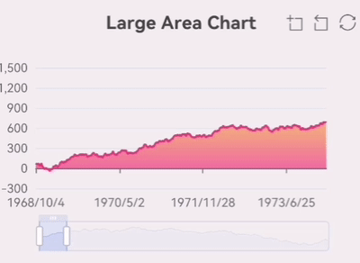

We have developed an [open source graphics library](https://github.com/wuba/wrn-echarts) for react native APP, which is based on [Apache ECharts](https://github.com/apache/echarts) and uses [RNSVG](https://github.com/react-native-svg/react-native-svg) or [RNSkia](https://github.com/shopify/react-native-skia) for rendering in a way that is almost identical to using it in the web, and can satisfy most graphics situations. The project source code is available at https://github.com/wuba/wrn-echarts.


## Introduction

When drawing charts, the chart library we use most frequently is ECharts. As one of the most mature chart libraries on the market, mainly for web-side use, there is no best way to use it in React Native, in the face of this situation, our solutions are:

Option 1, use a chart libraries developed specifically for React Native as an alternative, such as [react-native-charts-wrapper](https://github.com/wuxudong/react-native-charts-wrapper), [victory-native](https://github.com/FormidableLabs/victory/tree/main/packages/victory-native), etc. The style and interaction of these chart libraries are different from ECahrts, and the richness of charts is not enough. Especially in the scenario of multi-platform requirements, a separate UI interaction design is needed for React Native.

Option 2, charts are rendered by [react-native-webview](https://github.com/react-native-webview/react-native-webview), This solution uses injectedJavaScript for initialization and postMessage for event response, you can directly use open source libraries such as [react-native-echarts-pro](https://github.com/supervons/react-native-echarts-pro), [native-echarts](https://github.com/somonus/react-native-echarts), etc. When there are multiple charts or too many chart elements on the page, it will encounter performance bottlenecks, such as white screen phenomenon for large data volume area charts and single-axis scatter charts on Android, and there will be more obvious lag and frame drop during rendering.

Therefore, we consider developing a new chart library that can integrate the capabilities of ECharts into React Native applications for better usability and stronger performance.

Since we don’t want to write a graphics library from scratch, let’s look at what graphics libraries we currently have designed for React Native:

1. react-native-svg: provides SVG support to React Native on iOS, Android, macOS, Windows, and a compatibility layer for the web.
2. react-native-skia: React Native Skia brings the Skia Graphics Library to React Native. Skia serves as the graphics engine for Google Chrome and Chrome OS, Android, Flutter, Mozilla Firefox and Firefox OS, and many other products. It also provides an [ImageSVG](https://shopify.github.io/react-native-skia/docs/images-svg) component that supports rendering of SVG formatted images.

We know that ECharts supports SVG rendering, so if we get the SVG data before the chart is rendered and provide it to react-native-svg or react-native-skia for rendering, we will be able to achieve our goal.

After a period of experimentation, we have developed [wrn-echart](https://github.com/wuba/wrn-echarts) with the following features：

- 🔥 The same way as Apache ECharts
- 🎨 Rich charts, covering almost all usage scenarios
- ✨ Optional rendering library, Skia or SVG
- 🚀 Able to reuse code with web
- 📱 Support for zoom gestures

## How to use

In practice, the overall process for wrn-echarts is similar to ECharts:

1. yarn add wrn-echarts
2. Choose to install react-native-svg or @shopify/react-native-skia
3. Introduce the relevant components from wrn-echarts
4. Replace the SVGRenderer of ECharts with the SVGRenderer of wrn-echarts
5. Write the option configuration information for the chart
6. Use SkiaChart / SvgChart component

Here is the sample code：

```ts
// import { SkiaChart, SVGRenderer } from 'wrn-echarts';
import SkiaChart, { SVGRenderer } from 'wrn-echarts/lib/module/skiaChart';
import * as echarts from 'echarts/core';
import { useRef, useEffect } from 'react';
import { LineChart } from 'echarts/charts';

echarts.use([ SVGRenderer, LineChart ])

export default function App() {
  const skiaRef = useRef<any>(null);
  useEffect(() => {
    const option = {
      xAxis: {
        type: 'category',
        data: ['Mon', 'Tue', 'Wed', 'Thu', 'Fri', 'Sat', 'Sun']
      },
      yAxis: {
        type: 'value'
      },
      series: [
        {
          data: [150, 230, 224, 218, 135, 147, 260],
          type: 'line'
        }
      ]
    }
    let chart: any;
    if (skiaRef.current) {
      chart = echarts.init(skiaRef.current, 'light', {
        renderer: 'svg',
        width: 250,
        height: 300,
      });
      chart.setOption(option);
    }
    return () => chart?.dispose();
  }, []);

  return <SkiaChart ref={skiaRef} />;
}
```

Here is a screenshot of it:


Isn’t it particularly easy? More chart configurations can be viewed on the [echarts website](https://echarts.apache.org/examples/en/index.html).

We support most of the charts currently supported by ECharts. I will show some of the charts below, and more examples can be seen on the [taro-playground](https://github.com/wuba/taro-playground) project.





## Performance

As mentioned before, the mainstream solution for using ECharts in React Native is to implement it via WebView. Among the many WebView-based implementations, react-native-echarts-pro has more users, so we chose react-native-echarts-pro as a comparison.

The following are screenshots of the initialization process for the different implementations:


After quite a few test cases, we found that wrn-echarts has performance advantages in regular usage scenarios, but in scenarios with large amounts of data, there will be significant lag because of the declarative UI rendering method, which we will continue to explore to improve performance subsequently.

## Implementation details


Above is the flowchart of the library, taking react-native-svg as an example, the core workflow is:

1. Replace the SVGRenderer of ECharts, and replace the registered SVGPainter with the custom SVGPainter.
2. CustomSVGPainter inherits from SVGPainter, overwrites the constructor and part of the refresh function, calls the patch function registered on SVGComponent when the chart data is initialized or updated, and passes the calculated new SVG data to it.
3. Define SVGComponent, which manages the current chart instance and has a core patch function on it to receive real-time SVG data and then call the SVGElement function.
4. SVGElement function iterates all SVG nodes and transforms them into the corresponding SVG elements provided by react-native-svg for the final rendering action.

When using react-native-skia, there are some differences. There is a core method patchString on the defined SkiaComponent component. patchString receives the changed SVG data, converts it into SVG string, and passes it to the ImageSVG component of react-native-skia for rendering.

## Handling TouchEvent

ECharts events are mouse events, such as click, dblclick, mousedown, mousemove, etc. The mouse events are used to trigger the display or animation of the chart elements.

We use the PanResponder of React Native to capture the events, then simulate the mobile TouchEvent as a mouse event and dispatch it to the chart instance generated by the ECharts init method.

For example, the action of following the mouse to display the legend on the chart is TouchStart + TouchMove on the mobile side, which translates to a mouse event of mousedown + mousemove.

Another example is the zooming of the chart, the mobile side is two-finger zooming, which is translated to the mouse mousewheel event, and the corresponding mousewheel scrolling distance is calculated by the two-finger distance change.

Here is the key code:

1. Convert TouchEvent to MouseEvent

```ts
PanResponder.create({
  onPanResponderGrant: ({ nativeEvent }) => {
    // Action start, translated into mouse down and move events
    dispatchEvent(
      zrenderId,
      ['mousedown', 'mousemove'],
      nativeEvent,
      'start'
    );
  },
  onPanResponderMove: ({ nativeEvent }) => {
    // Handling finger movement operations
    const length = nativeEvent.touches.length;
    if (length === 1) {
      // single finger
    } else if (length === 2) {
      // Handling two-finger movement operations here
      if (!zooming) {
        // ...
      } else {
        // Here the event is converted to a scroll wheel
        const { initialX, initialY, prevDistance } = pan.current;
        const delta = distance - prevDistance;
        pan.current.prevDistance = distance;
        dispatchEvent(zrenderId, ['mousewheel'], nativeEvent, undefined, {
          zrX: initialX,
          zrY: initialY,
          zrDelta: delta / 120,
        });
      }
    }
  },
  onPanResponderRelease: ({ nativeEvent }) => {
    // The action is over, where it is transformed into a mouse click release operation
  },
})
```

2. Applying a MouseEvent to an ECharts chart instance

```ts
function dispatchEvent(
  zrenderId: number,
  types: HandlerName[],
  nativeEvent: NativeTouchEvent,
  stage: 'start' | 'end' | 'change' | undefined,
  props: any = {
    zrX: nativeEvent.locationX,
    zrY: nativeEvent.locationY,
  }
) {
  if (zrenderId) {
    var handler = getInstance(zrenderId).handler;
    types.forEach(function (type) {
      handler.dispatch(type, {
        preventDefault: noop,
        stopImmediatePropagation: noop,
        stopPropagation: noop,
        ...props,
      });
      stage && handler.processGesture(wrapTouch(nativeEvent), stage);
    });
  }
}
```

## For more information

Go to https://github.com/wuba/wrn-echarts to view the source code, and give us a star if you like it. If you encounter any problems, you can submit an [issue](https://github.com/wuba/wrn-echarts/issues).

The sample code in this post is on the https://github.com/wuba/taro-playground project, which is also open source, and interested parties can also install the new version of the Taro Playground app directly from the app store or from the [releases page](https://github.com/wuba/taro-playground/releases) to experience it.