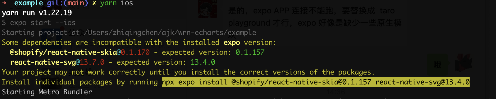

The most used chart library for writing chart-related requirements is **echarts**. The performance of echarts on the website is quite mature, and the official solution is provided for the applet side, but there is no corresponding support in RN. On the market, most of the search is still based on the essence of the webview implementation, and I prefer the RN-based program, after all, the native experience will be better than the Web.

Later found [**@wuba/react-native-echarts**](https://wuba.github.io/react-native-echarts/) to meet the needs, so try it out, the results are not bad. For those interested in the principle of implementation, click [here](https://wuba.github.io/react-native-echarts/blog/using-apache-echarts-in-react-native)

<!--truncate-->
### Tips

- If you already have an APP package, you can ignore the previous packaging process and start directly from step 4.
- The full code for the trial is on GitHub at: [https://github.com/iambool/TestApp](https://github.com/iambool/TestApp)

## The steps to use are as follows

### Step 1. Development environment setup

The process of building a local RN development environment is available on the Internet, so I won't go over it again. You can search for it on google :)

### Step 2. Creating an RN project

As it was a trial, I used the expo to newly initialize an rn project called TestApp.

```
npx create-expo-app TestApp
```


### Step 3. Building an app on mobile devices

Generate ios and android app packages with a command line. iOS is recommended to use the emulator (no need to match the certificate), while Android I was connected to the real machine.

```
yarn android
yarn ios
```

After generating the package, the app like the one below is already installed on the phone, which means it is successful.


### Step 4. Install related dependencies

```
yarn add @wuba/react-native-echarts echarts
yarn add @shopify/react-native-skia
yarn add react-native-svg
```

> Note: if you are installing in an existing project, you have to build a new package after the installation is complete, otherwise the lack of native dependencies will report an error.

### Step 5. Try the Skia model

@wuba/react-native-echarts supports two **rendering modes (Skia and Svg)**, try a simple chart with Skia first. It's divided into these small steps：

- Introduce echarts, chart components and other dependencies.
- Registering chart components.
- Create a chart instance and set an option.
- Synchronized destruction of chart instances when the page is destroyed.

The specific code is as follows:

```javascript
import { useRef, useEffect } from 'react';
import { View } from 'react-native';
/**
 * 1. Import the echarts dependency, this example first tries the line chart
 */
import * as echarts from 'echarts/core';
import { LineChart } from 'echarts/charts';
import { GridComponent } from 'echarts/components';
import { SVGRenderer, SkiaChart } from '@wuba/react-native-echarts';

/**
 * 2. Register the required components
 * SVGRenderer: it is required to register
 * LineChart: because we want to show the line chart, we have to import LineChart
 *      - If you don't know which components to import, just look at the error report and add whatever the error says is missing
 * GridComponent: This is the prompt when the error is reported, and then I added the, ha ha
 */
echarts.use([SVGRenderer, LineChart, GridComponent]);

export default () => {
  const skiaRef = useRef(null); // Ref for saving chart instances
  useEffect(() => {
    /**
     * 3. chart option
     */
    const option = {
      xAxis: {
        type: 'category',
        data: ['Mon', 'Tue', 'Wed', 'Thu', 'Fri', 'Sat', 'Sun'],
      },
      yAxis: {
        type: 'value',
      },
      series: [
        {
          data: [150, 230, 224, 218, 135, 147, 260],
          type: 'line',
        },
      ],
    };
    let chart;
    if (skiaRef.current) {
      /**
       * 4. Initialize the chart, specifying the lower width and height
       */
      chart = echarts.init(skiaRef.current, 'light', {
        renderer: 'svg',
        width: 400,
        height: 400,
      });
      chart.setOption(option);
    }
    /**
     * 5. To destroy the chart instance after the page is closed
     */
    return () => chart?.dispose();
  }, []);
  return (
    <View className='index'>
      <SkiaChart ref={skiaRef} />
    </View>
  );
};
```

After writing the code, shaking the phone and reloading the bundle package, an error was reported:

> ERROR Invariant Violation: requireNativeComponent: "SkiaDomView" was not found in the UIManager.

I googled it and it says it requires a [version downgrade](https://stackoverflow.com/questions/74648194/shopify-react-native-skia-with-expo). It should correspond to the expo version, there will be a similar prompt when installing the dependency, install the prompted version and it will be fine.


So I followed the instructions and did a version downgrade:

```
@shopify/react-native-skia@0.1.157
react-native-svg@13.4.0
```

It loaded up after rebuilding the app, which was nice. (but Android covers up the point, it seems that the screen width should be adaptive.)

| iOS                    | Android                        |
| ---------------------- | ------------------------------ |
|  |  |

### Step 6. Try the Svg model

Write a more complex dynamic sorting bar chart with Svg mode, and compare Svg and Skia by the way. The full code is [here](https://github.com/iambool/TestApp/blob/main/pages/barRace/index.js)。

```javascript
// ...Some unimportant code is omitted here

// Register the required components, such as BarChart and LegendComponent
echarts.use([SVGRenderer, BarChart, LegendComponent, GridComponent]);

export default () => {
  const skiaRef = useRef(null);
  const svgRef = useRef(null);

  useEffect(() => {
    // Skia mode
    const skiaChartData = getData(); // Generate chart bar data
    let skiaChart;
    let skiaInter;
    if (skiaRef.current) {
      skiaChart = echarts.init(skiaRef.current, 'light', {
        renderer: 'svg',
        width: 300,
        height: 300,
      });
      skiaChart.setOption(getDefaultOption(skiaChartData));
      setTimeout(function () {
        run(skiaChart, skiaChartData);
      }, 0);
      skiaInter = setInterval(function () {
        run(skiaChart, skiaChartData);
      }, 3000);
    }

    // Svg mode
    const svgChartData = getData();
    let svgChart;
    let svgInter;
    if (svgRef.current) {
      svgChart = echarts.init(svgRef.current, 'light', {
        renderer: 'svg',
        width: 300,
        height: 300,
      });
      svgChart.setOption(getDefaultOption(svgChartData));
      setTimeout(function () {
        run(svgChart, svgChartData);
      }, 0);
      svgInter = setInterval(function () {
        run(svgChart, svgChartData);
      }, 3000);
    }

    return () => {
      skiaChart?.dispose();
      svgChart?.dispose();
      // The timer has to be cleaned up, otherwise it will still run after exiting the page
      clearInterval(skiaInter);
      clearInterval(svgInter);
    };
  }, []);
  return (
    <View>
      <Text>skia</Text>
      <SkiaChart ref={skiaRef} />
      <Text>svg</Text>
      <SvgChart ref={svgRef} />
    </View>
  );
};
```

I can't see the difference between these two modes with my eyes.

| iOS                                | Android                                |
| ---------------------------------- | -------------------------------------- |
|  |  |

### Step 7. Wrapping Chart Components

So far the effect was quite good, but every time I used a bunch of things to import, It bothered me. Let's wrap it up simply:

```javascript
import { useRef, useEffect } from 'react';
import * as echarts from 'echarts/core';
import { BarChart, LineChart, PieChart } from 'echarts/charts';
import {
  DataZoomComponent,
  GridComponent,
  LegendComponent,
  TitleComponent,
  ToolboxComponent,
  TooltipComponent,
} from 'echarts/components';
import {
  SVGRenderer,
  SvgChart as _SvgChart,
  SkiaChart as _SkiaChart,
} from '@wuba/react-native-echarts';
import { Dimensions } from 'react-native';

// Register the required components
echarts.use([
  DataZoomComponent,
  SVGRenderer,
  BarChart,
  GridComponent,
  LegendComponent,
  ToolboxComponent,
  TooltipComponent,
  TitleComponent,
  PieChart,
  LineChart,
]);

// Default width and height of the chart
const CHART_WIDTH = Dimensions.get('screen').width; // Default with the phone screen width
const CHART_HEIGHT = 300;

const Chart = ({
  option,
  onInit,
  width = CHART_WIDTH,
  height = CHART_HEIGHT,
  ChartComponent,
}) => {
  const chartRef = useRef(null);

  useEffect(() => {
    let chart;
    if (chartRef.current) {
      chart = echarts.init(chartRef.current, 'light', {
        renderer: 'svg',
        width,
        height,
      });
      option && chart.setOption(option);
      onInit?.(chart);
    }
    return () => chart?.dispose();
  }, [option]);
  return <ChartComponent ref={chartRef} />;
};

const SkiaChart = (props) => <Chart {...props} ChartComponent={_SkiaChart} />;
const SvgChart = (props) => <Chart {...props} ChartComponent={_SvgChart} />;
// Just export these two guys
export { SkiaChart, SvgChart };
```

### Step 8. Using multiple charts

Once it’s wrapped, let’s write a page with multiple charts and see how it works. Here is a page for “e-commerce data analysis”, including a line chart, bar chart and pie chart. Below is the main code written with svg mode, click [here](https://github.com/iambool/TestApp/tree/main/pages/ECdata) for detailed code.

```javascript
import { SkiaChart } from '../../components/Chart';
import { ScrollView, Text, View } from 'react-native';
import { StatusBar } from 'expo-status-bar';
import { useCallback, useEffect, useState } from 'react';
import {
  defaultActual,
  lineOption,
  salesStatus,
  salesVolume,
  userAnaly,
  getLineData,
} from './contants';
import styles from './styles';
// Turn on chart loading
const showChartLoading = (chart) =>
  chart.showLoading('default', {
    maskColor: '#305d9e',
  });
// Close chart loading
const hideChartLoading = (chart) => chart.hideLoading();

export default () => {
  const [actual, setActual] = useState(defaultActual); // Recording real-time data

  useEffect(() => {
    // Assuming a recurring request for data
    const interv = setInterval(() => {
      const newActual = [];
      for (let it of actual) {
        newActual.push({
          ...it,
          num: it.num + Math.floor((Math.random() * it.num) / 100),
        });
      }
      setActual(newActual);
    }, 200);
    return () => clearInterval(interv);
  }, [actual]);

  const onInitLineChart = useCallback((myChart) => {
    showChartLoading(myChart);
    // Simulation of data requests
    setTimeout(() => {
      myChart.setOption({
        series: getLineData,
      });
      hideChartLoading(myChart);
    }, 1000);
  }, []);

  const onInitUserChart = useCallback((myChart) => {
    // Simulate data request, similar to onInitLineChart
  }, []);
  const onInitSaleChart = useCallback((myChart) => {
    // Simulate data request, similar to onInitLineChart
  }, []);
  const onInitStatusChart = useCallback((myChart) => {
    // Simulate data request, similar to onInitLineChart
  }, []);

  const chartList = [
    ['订单走势', lineOption, onInitLineChart],
    ['用户统计', userAnaly, onInitUserChart],
    ['各品类销售统计', salesVolume, onInitSaleChart],
    ['订单状态统计', salesStatus, onInitStatusChart],
  ];

  return (
    <ScrollView style={styles.index}>
      <StatusBar style='light' />
      <View>
        <View style={styles.index_panel_header}>
          <Text style={styles.index_panel_title}>实时数据</Text>
        </View>
        <View style={styles.index_panel_content}>
          {actual.map(({ title, num, unit }) => (
            <View key={title} style={styles.sale_item}>
              <View style={styles.sale_item_cell}>
                <Text style={styles.sale_item_text}>{title}</Text>
              </View>
              <View style={[styles.sale_item_cell, styles.num]}>
                <Text style={styles.sale_item_num}>{num}</Text>
              </View>
              <View style={[styles.sale_item_cell, styles.unit]}>
                <Text style={styles.sale_item_text}>{unit}</Text>
              </View>
            </View>
          ))}
        </View>
      </View>
      {chartList.map(([title, data, callback]) => (
        <View key={title}>
          <View style={styles.index_panel_header}>
            <Text style={styles.index_panel_title}>{title}</Text>
          </View>
          <View style={styles.index_panel_content}>
            <SkiaChart option={data} onInit={callback} />
          </View>
        </View>
      ))}
    </ScrollView>
  );
};
```

Reload the bundle and see the result

| iOS                          | Android                          |
| ---------------------------- | -------------------------------- |
|  |  |

After rendering, the interaction on iOS is very smooth, while the interaction on Android feels occasionally laggy (not because my phone is too bad, right?...)

Try Skia mode again


Well, although it can, it seems that Chinese can not be displayed properly, Android Chinese is not displayed, and iOS is a mess of code. After reading the documentation, skia currently does not support Chinese on the Android side, We can display Chinese on iOS by setting the font to ‘PingFang SC’, for example:

```javascript
const option = {
  title: {
    text: '我是中文',
    textStyle: {
      fontFamily: 'PingFang SC', // setting the font type
    },
  },
};
```

But every place that displays Chinese has to set the font... that or use Svg first, I'm lazy.

## Summary

After using it for a while, I summarized the following:

- In terms of support, @wuba/react-native-echarts supports all types of charts except GL series and map charts which are not yet supported, which is very enough for daily business. The code to implement the various charts in echarts can be found in [taro-playground](https://github.com/wuba/taro-playground).
- Interaction, iOS is very silky smooth, Android sometimes there are cases of frame drops.
- Performance: Performance is officially reported as better than other solutions.
  - I tried it, not a very large amount of data will not have any problems, but when the amount of data is too large (such as drawing a large amount of data heat map), the rendering speed significantly decreased a lot, which is a point waiting for the official to optimize.
  - In addition, if there are many charts on the page, the loading speed will be slow when debugging on the real machine, so it is recommended to use the simulator first.
- Chinese support, Svg mode supports Chinese, but Skia mode is not available yet.

The above is only a personal view, any questions welcome communication.
