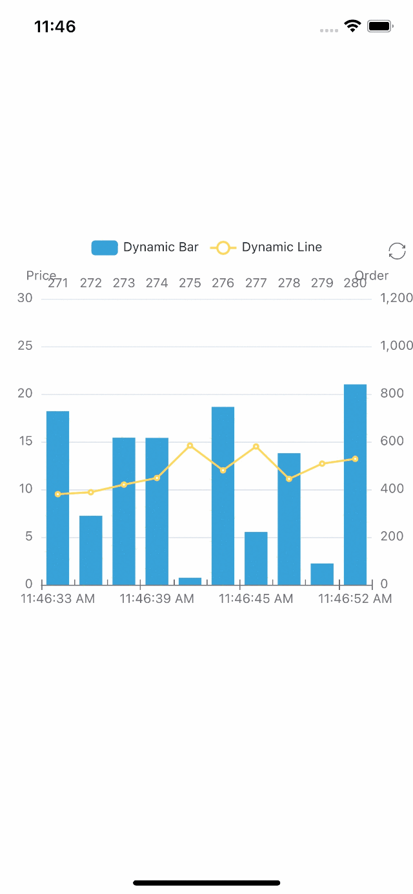

# Write a dynamic data chart

we try to draw a chart showing dynamic data changes with Svg mode, containing bar and line charts. It works on the browser side [here](https://echarts.apache.org/examples/en/editor.html?c=dynamic-data)。

1. first, import the chart dependencies as in the previous case.

the bar chart needs to be imported into BarChart, and the rest of the components used include ToolboxComponent, ToolboxComponent, TooltipComponent, LegendComponent, DataZoomComponent.

```tsx
import { BarChart } from 'echarts/charts';
import {
  ToolboxComponent,
  LegendComponent,
  TooltipComponent,
  DataZoomComponent,
} from 'echarts/components';
import { SVGRenderer, SvgChart } from 'wrn-echarts';
```

if you are not sure what components to import, you can refer to [here](/docs/trouble-shooting/troubleshooting/#error-echarts-component-xxx-is-used-but-not-imported) if you encounter error reports.

2. use echarts.use to register the renderer and chart.

```tsx
echarts.use([
  SVGRenderer,
  BarChart,
  ToolboxComponent,
  TooltipComponent,
  LegendComponent,
  DataZoomComponent,
]);
```

3. create a ref for the SvgChart.

```tsx
export default function App() {
  const svgRef = useRef<any>(null);
  return <SvgChart ref={svgRef} />;
}
```

4. writing options and data switching functions.

```tsx
const categories = (function () {
  let now = new Date();
  let res = [];
  let len = 10;
  while (len--) {
    res.unshift(now.toLocaleTimeString().replace(/^\D*/, ''));
    now = new Date(+now - 2000);
  }
  return res;
})();
const categories2 = (function () {
  let res = [];
  let len = 10;
  while (len--) {
    res.push(10 - len - 1);
  }
  return res;
})();
const data = (function () {
  let res = [];
  let len = 10;
  while (len--) {
    res.push(Math.round(Math.random() * 1000));
  }
  return res;
})();
const data2 = (function () {
  let res = [];
  let len = 0;
  while (len < 10) {
    res.push(+(Math.random() * 10 + 5).toFixed(1));
    len++;
  }
  return res;
})();
const option = {
  tooltip: {
    trigger: 'axis',
    axisPointer: {
      type: 'cross',
      label: {
        backgroundColor: '#283b56',
      },
    },
  },
  legend: {},
  toolbox: {
    show: true,
    feature: {
      dataView: { show: false, readOnly: false },
      restore: {},
    },
  },
  dataZoom: {
    show: false,
    start: 0,
    end: 100,
  },
  xAxis: [
    {
      type: 'category',
      boundaryGap: true,
      data: categories,
    },
    {
      type: 'category',
      boundaryGap: true,
      data: categories2,
    },
  ],
  yAxis: [
    {
      type: 'value',
      scale: true,
      name: 'Price',
      max: 30,
      min: 0,
      boundaryGap: [0.2, 0.2],
    },
    {
      type: 'value',
      scale: true,
      name: 'Order',
      max: 1200,
      min: 0,
      boundaryGap: [0.2, 0.2],
    },
  ],
  series: [
    {
      name: 'Dynamic Bar',
      type: 'bar',
      xAxisIndex: 1,
      yAxisIndex: 1,
      data: data,
    },
    {
      name: 'Dynamic Line',
      type: 'line',
      data: data2,
    },
  ],
};
```

5. create a chart instance and set the option.

```tsx
let chart = echarts.init(svgRef.current, 'light', {
  renderer: 'svg',
  width: E_WIDTH,
  height: E_HEIGHT,
});
chart.setOption(option);
```

6. after the instance is created, the data is updated periodically to achieve the animation.

```tsx
let count = 11;
inter = setInterval(function () {
  let axisData = new Date().toLocaleTimeString().replace(/^\D*/, '');

  data.shift();
  data.push(Math.round(Math.random() * 1000));
  data2.shift();
  data2.push(+(Math.random() * 10 + 5).toFixed(1));

  categories.shift();
  categories.push(axisData);
  categories2.shift();
  categories2.push(count++);

  chart.setOption({
    xAxis: [
      {
        data: categories,
      },
      {
        data: categories2,
      },
    ],
    series: [
      {
        data: data,
      },
      {
        data: data2,
      },
    ],
  });
}, 2100);
```

7. use useEffect to make sure the chart is initialized only once. Don't forget to dispose the chart and clear the timer when the component is unmounted.

```tsx
useEffect(() => {
  return () => {
    chart?.dispose();
    clearInterval(inter);
  };
}, []);
```

That's it! Here is the code:

```tsx
import { useRef, useEffect } from 'react';
import * as echarts from 'echarts/core';
import { Dimensions, StyleSheet, View } from 'react-native';
import { BarChart } from 'echarts/charts';
import {
  ToolboxComponent,
  LegendComponent,
  TooltipComponent,
  DataZoomComponent,
} from 'echarts/components';
import { SVGRenderer, SvgChart } from 'wrn-echarts';

echarts.use([
  SVGRenderer,
  BarChart,
  ToolboxComponent,
  TooltipComponent,
  LegendComponent,
  DataZoomComponent,
]);

const E_HEIGHT = 400;
const E_WIDTH = Dimensions.get('screen').width;

const categories = (function () {
  let now = new Date();
  let res = [];
  let len = 10;
  while (len--) {
    res.unshift(now.toLocaleTimeString().replace(/^\D*/, ''));
    now = new Date(+now - 2000);
  }
  return res;
})();
const categories2 = (function () {
  let res = [];
  let len = 10;
  while (len--) {
    res.push(10 - len - 1);
  }
  return res;
})();
const data = (function () {
  let res = [];
  let len = 10;
  while (len--) {
    res.push(Math.round(Math.random() * 1000));
  }
  return res;
})();
const data2 = (function () {
  let res = [];
  let len = 0;
  while (len < 10) {
    res.push(+(Math.random() * 10 + 5).toFixed(1));
    len++;
  }
  return res;
})();
const option = {
  tooltip: {
    trigger: 'axis',
    axisPointer: {
      type: 'cross',
      label: {
        backgroundColor: '#283b56',
      },
    },
  },
  legend: {},
  toolbox: {
    show: true,
    feature: {
      dataView: { show: false, readOnly: false },
      restore: {},
    },
  },
  dataZoom: {
    show: false,
    start: 0,
    end: 100,
  },
  xAxis: [
    {
      type: 'category',
      boundaryGap: true,
      data: categories,
    },
    {
      type: 'category',
      boundaryGap: true,
      data: categories2,
    },
  ],
  yAxis: [
    {
      type: 'value',
      scale: true,
      name: 'Price',
      max: 30,
      min: 0,
      boundaryGap: [0.2, 0.2],
    },
    {
      type: 'value',
      scale: true,
      name: 'Order',
      max: 1200,
      min: 0,
      boundaryGap: [0.2, 0.2],
    },
  ],
  series: [
    {
      name: 'Dynamic Bar',
      type: 'bar',
      xAxisIndex: 1,
      yAxisIndex: 1,
      data: data,
    },
    {
      name: 'Dynamic Line',
      type: 'line',
      data: data2,
    },
  ],
};

export default () => {
  const svgRef = useRef(null);

  useEffect(() => {
    let chart;
    let inter;
    if (svgRef.current) {
      chart = echarts.init(svgRef.current, 'light', {
        renderer: 'svg',
        width: E_WIDTH,
        height: E_HEIGHT,
      });
      chart.setOption(option);

      let count = 11;
      inter = setInterval(function () {
        let axisData = new Date().toLocaleTimeString().replace(/^\D*/, '');

        data.shift();
        data.push(Math.round(Math.random() * 1000));
        data2.shift();
        data2.push(+(Math.random() * 10 + 5).toFixed(1));

        categories.shift();
        categories.push(axisData);
        categories2.shift();
        categories2.push(count++);

        chart.setOption({
          xAxis: [
            {
              data: categories,
            },
            {
              data: categories2,
            },
          ],
          series: [
            {
              data: data,
            },
            {
              data: data2,
            },
          ],
        });
      }, 2100);
    }
    return () => {
      chart?.dispose();
      clearInterval(inter);
    };
  }, []);
  return (
    <View style={styles.container}>
      <SvgChart ref={svgRef} />
    </View>
  );
};

const styles = StyleSheet.create({
  container: {
    flex: 1,
    alignItems: 'center',
    justifyContent: 'center',
  },
});
```

You should see the following screen:

| iOS                            | Android                                |
| ------------------------------ | -------------------------------------- |
|  |  |

If you want to use the react-native-skia，just replace the SvgChart with SkiaChart。

For more chart configuration, please refer to [echarts documentation](https://echarts.apache.org/en/option.html#title).
