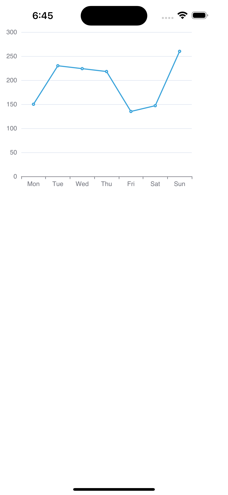

# Write a simple line chart

Next let's try to draw the most basic diagram - Basic Line Chart.

To see how it looks like in the browser, you can visit the [echarts editor](https://echarts.apache.org/examples/en/editor.html?c=line-simple) and try to modify the configuration to see the changes.

1. import echarts, wrn-echarts, react. Here I have only import SkiaChart and SVGRenderer.

```tsx
import { useRef, useEffect } from 'react';
import * as echarts from 'echarts/core';
import { LineChart } from 'echarts/charts';
import SkiaChart, { SVGRenderer } from 'wrn-echarts/lib/module/skiaChart';
```

2. use echarts.use to register the renderer and chart.

```tsx
echarts.use([ SVGRenderer, LineChart ])
```

3. create a ref for the SkiaChart.

```tsx
export default function App() {
  const skiaRef = useRef<any>(null);
  return <SkiaChart ref={skiaRef} />;
}
```

4. write the chart option.

```tsx
const option = {
  xAxis: {
    type: 'category',
    data: ['Mon', 'Tue', 'Wed', 'Thu', 'Fri', 'Sat', 'Sun']
  },
  yAxis: {
    type: 'value'
  },
  series: [
    {
      data: [150, 230, 224, 218, 135, 147, 260],
      type: 'line'
    }
  ]
}
```

5. create a chart instance and set the option.

```tsx
let chart = echarts.init(skiaRef.current, 'light', {
  renderer: 'svg',
  width: 250,
  height: 300,
});
chart.setOption(option);
```

6. use useEffect to make sure the chart is initialized only once. And dispose the chart when the component is unmounted.

```tsx
useEffect(() => {
  return () => chart?.dispose();
}, []);
```

That's it! Blow is the code:
```tsx
import { useRef, useEffect } from 'react';
import * as echarts from 'echarts/core';
import { LineChart } from 'echarts/charts';
import SkiaChart, { SVGRenderer } from 'wrn-echarts/lib/module/skiaChart';

echarts.use([ SVGRenderer, LineChart ])

export default function App() {
  const skiaRef = useRef<any>(null);
  useEffect(() => {
    const option = {
      xAxis: {
        type: 'category',
        data: ['Mon', 'Tue', 'Wed', 'Thu', 'Fri', 'Sat', 'Sun']
      },
      yAxis: {
        type: 'value'
      },
      series: [
        {
          data: [150, 230, 224, 218, 135, 147, 260],
          type: 'line'
        }
      ]
    }
    let chart: any;
    if (skiaRef.current) {
      chart = echarts.init(skiaRef.current, 'light', {
        renderer: 'svg',
        width: 400,
        height: 400,
      });
      chart.setOption(option);
    }
    return () => chart?.dispose();
  }, []);

  return <SkiaChart ref={skiaRef} />;
}
```
You should see the following screen:

| iOS | Android |
| --- | --- |
|  |  |

If you want to use the SvgChart, you can import it from wrn-echarts/lib/module/svgChart.
```tsx
import SvgChart, { SVGRenderer } from 'wrn-echarts/lib/module/svgChart';
```
and replace the SkiaChart with SvgChart.

Next you can find more configurations to use in wrn-echarts from the [echarts examples](https://echarts.apache.org/examples/en/index.html).