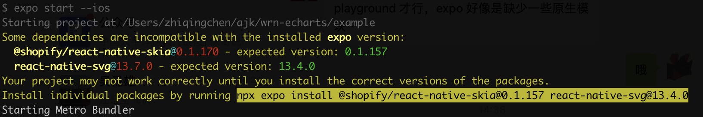

# Troubleshooting

<!-- - ### skia/svg 版本与 expo 内置版本对应 -->

- ### ERROR Invariant Violation: requireNativeComponent: "SkiaDomView" was not found in the UIManager.

  If expo is used, you need to install the version of skia/svg that corresponds to the version built into expo, otherwise the above error will occur. If you are not sure which version should be installed, you can refer to the version recommended at expo startup, e.g.

  

<!-- 组件未注册 -->

- ### ERROR [ECharts] Component XXX is used but not imported.

  The above error indicates that the XXX component is used in the chart but has not been registered. The components used in the chart need to be registered manually in the following way.

  ```js
  import { XXX } from 'echarts/components';
  echarts.use([XXX]);
  ```

<!-- ### 初始化时没有series -->

- ### ERROR [ECharts] Unknown series undefined
  When the above error occurs during chart restoration, it is likely that the option was passed in as an empty object during the initialization of the chart object, or that the object was passed in without a series field, as in this case `chartInstance.setOption({})`. When initializing, the option should be passed into the series configuration as much as possible.
