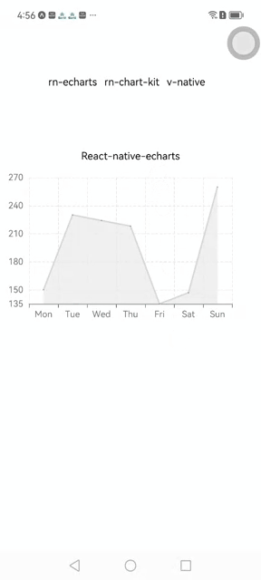
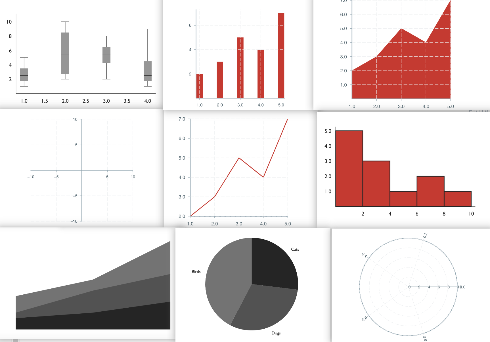

> イントロダクション：現代のモバイルアプリケーション開発において、データの可視化は重要な要素です。チャートライブラリは、React Nativeアプリケーションにおいてデータを視覚的に表示し、分析するために開発者をサポートします。React Nativeコミュニティには多くの優れたチャートライブラリがあります。この記事では、React Native ECharts、Victory Native、React Native Chart Kitの3つの人気のあるチャートライブラリを比較します。それでは、比較的旅に出て、React Native ECharts、Victory Native、React Native Chart Kitの違いについて探求してみましょう。

## チャートライブラリの紹介

- **React Native Chart Kit**

  [React Native Chart Kit](https://github.com/indiespirit/React-native-chart-kit)は2018年に開発され、その創設から5年が経ちました。累計ダウンロード数は2,840,757回で、GitHubでは2.5k以上のスターを獲得しています。React Nativeコミュニティで非常に人気のあるライブラリとなっています。

- **Victory Native**

  [Victory Native](https://formidable.com/open-source/victory/)は2015年に開発されたチャートライブラリです。その創設から7年が経ちました。累計ダウンロード数は7,434,044回で、GitHubでは10.3k以上のスターを獲得しています。React Nativeの歴史上、最も長く使われているチャートライブラリです。

- **React Native ECharts**

  [React Native ECharts](https://wuba.github.io/react-native-echarts/)は今年リリースされた新しいチャートライブラリです。現在のダウンロード数は2,565回で、GitHubでは363のスターを獲得しています。React Nativeのチャートライブラリの中で急成長している存在であり、将来的には最も人気のあるチャートライブラリの一つになると期待されています。

  以下は基本データの比較表です：

  | |  **React Native Chart Kit**   | **Victory Native**  | **React Native ECharts** |
  | --- |  :----:  | :----:  | :---: |
  | 作成日 | 2018  | 2015 | 2023 |
  | ダウンロード数 | 2,840,757  | 7,434,044 | 2565 |
  | 展開サイズ | 399kB  | 78.4kB  | 169kB  |
  | GitHubスター | 2.5k+  | 10.3k+ | 363 |
  | 最終公開日 | 1年前  | 1ヶ月前 | 1ヶ月前 |

## 基本原則の比較

- **React Native Chart Kit**
主なアプローチは、React Nativeのネイティブビューコンポーネント（View、Textなど）を使用してチャートの基本的な構造とレイアウトを作成することです。さらに、react-native-svgやpaths-jsなどのライブラリを使用して、ベクターグラフィックスでチャートをレンダリングします。

- **Victory Native**
Victory NativeもReact Nativeのネイティブビューを使用し、SVGをレンダリングに利用します。また、データをチャート要素にマッピングし、スケールを使用してデータの値と位置を変換するために、D3（Data-Driven Documents）からインスピレーションを受けています。

- **React Native ECharts**
React Native EChartsは、EChartsのチャートのSVGグラフィックデータを取得し、EChartsのSVGPainterを書き換えます。既存のEChartsのチャートデータを利用して、react-native-svgまたはreact-native-skiaを使用してReact Native側でチャートをレンダリングします。


## コードの記述比較

一般的に使用されるエリアチャートを例にして、以下のコードスニペットを使用してそれぞれの実装方法を見てみましょう：

- **React Native Chart Kit**

```js
import { LineChart } from"react-native-chart-kit";
import { StyleSheet, View, Text } from 'react-native';
const chartConfig = {
   backgroundGradientFrom: "#fff",
   backgroundGradientFromOpacity: 0,
   backgroundGradientTo: "#fff",
   backgroundGradientToOpacity: 0.5,
   color: (opacity = 1) => `rgba(14, 17, 22, ${opacity})`,
   strokeWidth: 2, // optional, default 3
   barPercentage: 0.5,
   useShadowColorFromDataset: false // optional
};
export const LineChart1 = props => {
   const data = {
      labels: ['Mon', 'Tue', 'Wed', 'Thu', 'Fri', 'Sat', 'Sun'],
      // labels: props.date,
      datasets: [
       {
        data: [150, 230, 224, 218, 135, 147, 260],
        // color: (opacity = 1) => `rgba(134, 65, 244, ${opacity})`, // optional
        strokeWidth: 2 // optional
       }
      ],
    };
   return (
      <View style={styles.container}>
        <Text>React Native Chart Kit</Text>
        <LineChart
           data={data}
           width={400}
           height={200}
           yAxisInterval={1}
           animate
           chartConfig={chartConfig}
           withDots={false}
        />
    </View>
   )

}

```

- **Victory Native**

```js
import { StyleSheet, View, Text } from "react-native";
import {
  VictoryArea,
  VictoryChart,
  VictoryLine,
  VictoryTheme,
  VictoryScatter,
} from "victory-native";

export const LineChart2 = props => {
  const data = [
    { x: 'Mon', y: 150 },
    { x: 'Tue', y: 230 },
    { x: 'Wed', y: 224 },
    { x: 'Thu', y: 218 },
    { x: 'Fri', y: 135 },
    { x: 'Sat', y: 147 },
    { x: 'sun', y: 260 },
   ];
  return (
   <View style={styles.container}>
    <Text style={styles.title}>Victory Native</Text>
    <VictoryChart
      theme={VictoryTheme.material}
      height={250}
      width={400}
    >
      <VictoryArea
       style={{ data: { fill: "rgba(230, 231, 231,0.8)" } }}
       data={data}
       animate={{
        duration: 2000,
        onLoad: { duration: 1000 },
       }}
      />
      <VictoryLine
       data={data}
       style={{ data: { stroke: "#d6d6d7", strokeWidth: 2 } }}
      />
      <VictoryScatter
       data={data}
       size={4}
       style={{ data: { fill: "#24262a" } }}
      />
    </VictoryChart>
   </View>
  );
};

```

- **React Native ECharts**

```js
import { StyleSheet, Text, View } from 'react-native';
import { useRef, useEffect } from 'react';
import * as echarts from 'echarts/core';
import { LineChart } from 'echarts/charts';
import { GridComponent } from 'echarts/components';
import { SVGRenderer, SkiaChart } from '@wuba/react-native-echarts';
echarts.use([SVGRenderer, LineChart, GridComponent]);
export const LineCharts = props => {
  const skiaRef = useRef(null);
  useEffect(() => {
   const option = {
    xAxis: {
      type: 'category',
      data:  ['Mon', 'Tue', 'Wed', 'Thu', 'Fri', 'Sat', 'Sun'],
      splitLine: {
       show: true,
       lineStyle: {
        type: 'dashed',
       },}
    },
    yAxis: {
      type: 'value',
      min: 'dataMin',
      splitLine: {
       show: true,
       lineStyle: {
        type: 'dashed',
       },}
    },
    series: [
      {
       data: [150, 230, 224, 218, 135, 147, 260],
       type: 'line',
       areaStyle: {
        color: 'rgba(230, 231, 231,0.8)'
       },
       lineStyle: {
        color: '#d6d6d7'
       },
       symbol: 'circle',
       symbolSize: 8,
       itemStyle: {
        color: '#24262a',
       },
      },
    ],
   };
   let chart;
   if (skiaRef.current) {
    chart = echarts.init(skiaRef.current, 'light', {
      renderer: 'svg',
      width: 400,
      height: 300,
    });
    chart.setOption(option);
   }
   return () => chart?.dispose();
  }, []);
  return (
   <View style={styles.container}>
      <Text style={styles.title}>React Native ECharts</Text>
      <SkiaChart ref={skiaRef} />
   </View>
  );
}
```

以下は、効果が表示される方法です：




コードの記述方法に関しては、**Victory Native**はデータ駆動型であり、通常はデータを渡し、関連するスタイルをプロップスで設定します。最も重要なのは、ツールセットのようなものであり、DIYできるということです。Victoryが提供するさまざまなコンポーネントを使用して、必要に応じてチャートをカスタマイズすることができます。たとえば、エリアチャートに線やデータポイントを追加する場合、VictoryLineとVictoryScatterコンポーネントを追加する必要があります。

React Native Echartsと**React Native Chart Kit**は使用方法が似ています。両方のライブラリは、設定オプション内でデータとスタイルを集約します。これらは、設定を変更することでチャートを変形させることができる、完全な機能を備えたツールのようなものです。比較的に、**React Native Chart Kit**の設定コードはシンプルですが、一部の高度なカスタマイズオプションが欠けているかもしれません。たとえば、アニメーションを有効にしたり、y軸の特定の開始値を設定したりすることはできないかもしれません。

コードの記述方法に関しては、設定ベースのアプローチが好ましいです。それは直感的で理解しやすく、開発者の開発効率を向上させることができます。

## 開発体験

### レンダリングパフォーマンスの比較

エリア、バー、パイなどの通常のチャートに関しては、3つのライブラリとも、データセットが小さい場合にはスムーズなレンダリングを提供します。しかし、データサイズが数千に達すると、パフォーマンスの違いが顕著になります。**Victory Native**と**React Native Chart Kit**は大幅な遅延を経験し、大規模なデータセットの場合、Victoryはクラッシュすることさえあります。一方、**React Native ECharts**は、EChartsのデフォルトのデータサンプリングメカニズムを活用しています。これにより、大量のデータをレンダリングする際にチャートが過密になることやパフォーマンスの低下を回避することができます。EChartsは、プロットエリアの幅とデータポイントの数に基づいて、比較的少数のデータポイントを自動的にサンプリングし、計算およびレンダリング時間を削減します。このメカニズムを活用することで、**React Native ECharts**は大規模なデータセットを扱う際に優れたレンダリングパフォーマンスを示します。

以下は、ランダムに生成された200のデータポイントを使用してエリアチャートをレンダリングする例です：


見てわかるように、**React Native ECharts**は比較的良好なレンダリングパフォーマンスを維持しています。一方、他の2つのライブラリを使用する場合は、特定のビジネス要件を満たすためにデータや座標の調整が必要です。

テストデータを2000ポイントに増やすと、**React Native Chart Kit**は顕著なレンダリングの遅延が発生し、**Victory Native**は最大呼び出しスタックサイズが超過されたというエラーが発生します。一方、データサンプリングを活用する**React Native ECharts**は、依然として満足のいくレンダリング結果を提供します：


### チャートのバラエティの比較

- **React Native Chart Kit**
現在、**React Native Chart Kit**は比較的少数のチャートタイプをサポートしています。主に6つの特定のチャートタイプをカバーしており、ほとんどの基本的なビジネス要件を満たすことができます。ただし、他のタイプのチャートが必要な場合は、追加のライブラリを導入する必要があります。

  以下の画像は、**React Native Chart Kit**がカバーできるほとんどのチャートタイプを示しており、バラエティが比較的限られていることがわかります。😭現在、開発者はライブラリを継続的にメンテナンスしており、将来的にはさらに多くのチャートタイプが追加される可能性があります。


<font size>(画像の出典: https://github.com/indiespirit/react-native-chart-kit)</font>

- **Victory Native**
チャートのバラエティに関して、**Victory Native**は**React Native Chart Kit**と比較して幅広い範囲を提供しています。ただし、Victoryのアプローチの性質上、異なるタイプのチャートを作成するためにコンポーネントを組み合わせる必要があり、開発者はコンポーネントの構成を理解し、堅固なコーディングスキルを持っている必要があります。また、公式のVictoryウェブサイトで提供される例は初心者には直感的ではない場合があります。全体的に、**Victory Native**の使用には、より高いレベルのコーディング能力と論理的思考が必要です。

以下の画像は、Victoryが公式ウェブサイトで提供している主要なコンポーネントを示しています。**React Native Chart Kit**と比較して、利用可能なオプションがはるかに多いことがわかります。さらに、**Victory Native**は主にこれらのコンポーネント（ポイント、ライン、エリア、軸など）を組み合わせてさまざまなタイプのチャートを作成することに依存しています。これにより、サポートされるチャートの種類が広がります。

<font size="2">(画像の出典: https://formidable.com/open-source/victory/docs/)</font>


- **React Native ECharts**
**React Native ECharts**では、EChartsの公式ウェブサイトで提供されている例を参照することで、直感的な方法でさまざまなタイプのチャートを作成することができます。開発者は設定オプションを使用してチャートをカスタマイズすることができます。現在、**React Native ECharts**はEChartsが提供するほとんどのチャートタイプのレンダリングをサポートしています。

**React Native ECharts**はEChartsのSVGデータを利用しているため、EChartsのウェブサイトで提供されている例を参照し、設定を調整するだけでさまざまなタイプのチャートを簡単に作成できます😍


<font size="2">(画像の出典: https://echarts.apache.org/examples/zh/index.html)</font>

以下の画像は、他のライブラリでは簡単に実装できないか、複雑な組み合わせが必要なチャートの例を示しています。しかし、**React Native ECharts**を使用すると、ドキュメントを参照するだけでこれらのチャートを簡単に実現できます🚀


### ガイドの比較

**React Native Chart Kit**の使用を始めるには、主にGitHubやnpmで提供されるドキュメントや設定オプションを使用します。これらのリソースを参照することで、開発者はプロジェクトでチャートのレンダリングを簡単に実装することができます。

一方、**Victory Native**には[公式ウェブサイト](https://formidable.com/open-source/victory/docs/)があり、開発者はドキュメント内の提供されているコンポーネントや関連するコードを参照してチャートを組み立てることができます。ただし、ウェブサイトには多数のコンポーネントや要素があり、開発者が迅速に目的の例を見つけることは困難です。複雑なチャートの実装には、開発者が独自の実装方法を考える必要があり、開発効率が低下する可能性があります。

**React Native ECharts**は、次の点で優れています：

- ドキュメント

  **Victory Native**の[公式ドキュメント](https://wuba.github.io/react-native-echarts/)は、より明確で包括的であり、使いやすい例が提供されています。開発者はドキュメントを通じて、ライブラリの機能、設定、使用方法を簡単に理解することができます。また、公式のEChartsウェブサイトには、さまざまなタイプのチャートを迅速に実装するための多数の[使用例](https://echarts.apache.org/examples/zh/index.html)があります。

- オンラインプレビュー

  EChartsライブラリと同様に、**React Native ECharts**はオンラインプレビューとテストのサポートを提供しています。チャートの設定を直接コピーして、React Nativeでのレンダリングを確認することができます。[オンラインプレビューはこちら](https://wuba.github.io/react-native-echarts/zh-Hans/docs/expo-snacks/simple-line-chart)

- マルチターミナルコード

  **React Native ECharts**は、Web上でのコンポーネントの再利用もサポートしており、クロスプラットフォームの要件を実現し、複数のプラットフォーム間でのコード共有を実現します。コードの統一性を容易に実現し、異なるプラットフォーム間でのチャートの一貫性を確保することで、開発効率を向上させます。

- 2つのレンダリングモードのサポート

  **React Native ECharts**は、SvgとSkiaの2つのレンダリングモードをサポートしています。これは、react-native-svgとreact-native-skiaに基づいて実装されています。react-native-skiaはSkia Graphics Libraryを利用しており、より高速な描画とレンダリング速度を提供します。Skiaの機能を体験したい開発者にとっては利点です。

## 結論
最後に、以下の観点からこれら3つのチャートライブラリのパフォーマンスを比較しましょう：

  | |  **React Native Chart Kit**   | **Victory Native**  | **React Native ECharts** |
  | --- |  :----:  | :----:  | :---: |
  | 基本的なチャートの適用性  | ✅  | ✅  | ✅  |
  | チャートのバラエティ | ➖ | ✅ | ✅ |
  | 大量データのレンダリング | ➖  | ➖  | ✅  |
  | 開発の容易さ | ✅  | ➖  | ✅ |
  | マルチターミナルコード | ➖  | ➖ | ✅ |

**Victory Native**と**React Native Chart Kit**は、どちらもReact Native向けの優れたチャートライブラリです。しかし、新しく導入された**React Native ECharts**は、適用性とエントリーの容易さの点で特に優れています。特にパスチャート、レーダーチャート、ローソク足チャートなどの比較的複雑なが一般的なチャートでは、**React Native ECharts**は例のコードのデータを変更するだけで簡単に実装できる例が提供されています。これらのシナリオでは、開発効率が大幅に向上するため、**React Native ECharts**を強くお勧めします。さらに、さまざまなタイプのチャートに高い要求があるプロジェクトでは、**React Native ECharts**が提供する豊富なチャートのコレクションが、多様なチャートの要件を処理しやすくしてくれます😁

