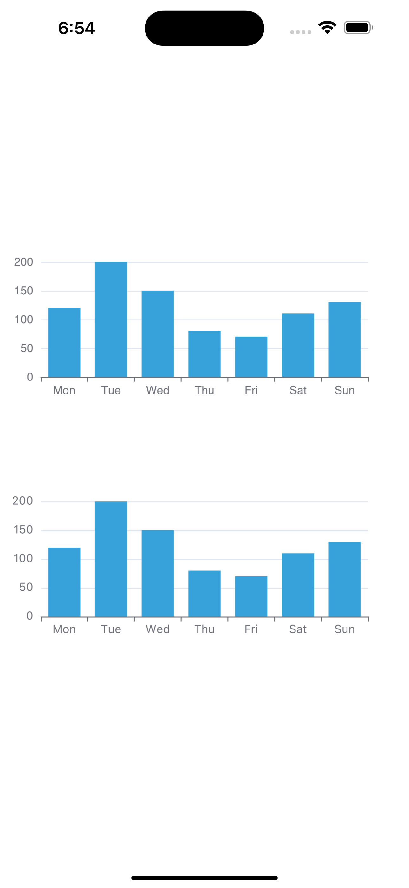

# サンプルの実行

1. wuba/react-native-echarts リポジトリをクローンします

```shell
git clone git@github.com:wuba/react-native-echarts.git
```

2. 依存関係をインストールします

```shell
yarn
```

3. サンプルディレクトリに移動します

```shell
cd example
```

4. iOS または Android を実行します

```shell
yarn ios
# または
yarn android
```

以上です！以下の画面が表示されるはずです:

| iOS | Android |
| --- | --- |
|  |  |

おめでとうございます！サンプルの実行に成功しました。