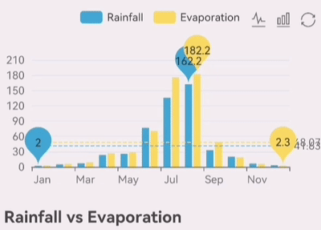

我们为 react native APP 开发了一个[开源图形库](https://github.com/wuba/react-native-echarts)，它基于 [Apache ECharts](https://github.com/apache/echarts)，使用 [RNSVG](https://github.com/react-native-svg/react-native-svg) 或 [RNSkia](https://github.com/shopify/react-native-skia) 进行渲染，其方式与在浏览器中中使用几乎相同，可以满足大多数绘图场景。该项目源代码可在 https://github.com/wuba/react-native-echarts 中查看。


<!--truncate-->
## 介绍

在绘制图表时，我们最常使用的图表库是 ECharts。作为市场上最成熟的图表库之一，主要用于 Web 端，在 React Native 中并没有最好的使用方法，面对这种情况，我们的解决方案有两种：

方案一，使用专门为 React Native 开发的图表库作为替代，比如 [react-native-charts-wrapper](https://github.com/wuxudong/react-native-charts-wrapper)，[victory-native](https://github.com/FormidableLabs/victory/tree/main/packages/victory-native) 等。这些图表库的风格和交互方式与 ECahrts 不同，而且图表的丰富性也不够。特别是在多平台需求的场景下，需要对 React Native 进行单独的 UI 交互设计。

方案二，图表由 [react-native-webview](https://github.com/react-native-webview/react-native-webview) 渲染，此方案使用 injectedJavaScript 进行初始化，使用 postMessage 进行事件响应，可以直接使用 [react-native-echarts-pro](https://github.com/supervons/react-native-echarts-pro)、[native-echarts](https://github.com/somonus/react-native-echarts) 等开源库。当页面上有多个图表或图表元素过多时，会遇到性能瓶颈，如 Android 上的大数据量区域图和单轴散点图会出现白屏现象，渲染时有比较明显的滞后和掉帧。

因此，我们考虑开发一个新的图表库，可以将 ECharts 的功能整合到 React Native 应用中，以获得更好的可用性和更强的性能。

因为我们不想从头开始写一个图形库，所以我们来看看目前有哪些为 React Native 设计的图形库：

1. react-native-svg：为 iOS、Android、macOS、Windows上的 React Native 提供 SVG 支持，并为浏览器提供一个兼容层。
2. react-native-skia：React Native Skia 将 Skia 图形库引入 React Native。Skia 作为 Google Chrome 和 Chrome OS、Android、Flutter、Mozilla Firefox 和 Firefox OS 以及许多其他产品的图形引擎。它还提供了一个 [ImageSVG](https://shopify.github.io/react-native-skia/docs/images-svg) 组件，支持渲染 SVG 格式的图片。

我们知道 ECharts 支持 SVG 渲染，所以如果我们在图表渲染之前获得 SVG 数据并提供给 react-native-svg 或 react-native-skia 进行渲染，我们就能实现我们的目标了。

经过一段时间的实验，我们开发了 [@wuba/react-native-echart](https://github.com/wuba/react-native-echarts)，具有以下特点：

- 🔥 与 Apache ECharts 的使用方式相同
- 🎨 丰富的图表，几乎涵盖所有的使用场景
- ✨ 可选的渲染库，Skia 或 SVG
- 🚀 可与 web 页面复用代码
- 📱 支持缩放手势

## 如何使用

在实践中，@wuba/react-native-echarts 的整体流程与 ECharts 类似：

1. 安装 @wuba/react-native-echarts
2. 选择安装 react-native-svg 或 @shopify/react-native-skia
3. 引入 @wuba/react-native-echarts 的相关组件
4. 用 @wuba/react-native-echarts 的 SVGRenderer 替换 ECharts 的 SVGRenderer
5. 编写图表的选项配置信息
6. 使用 SkiaChart 或 SvgChart 组件

下面是示例代码：

```ts
// import { SkiaChart, SVGRenderer } from '@wuba/react-native-echarts';
import SkiaChart, { SVGRenderer } from '@wuba/react-native-echarts/skiaChart';
import * as echarts from 'echarts/core';
import { useRef, useEffect } from 'react';
import { LineChart } from 'echarts/charts';

echarts.use([ SVGRenderer, LineChart ])

export default function App() {
  const skiaRef = useRef<any>(null);
  useEffect(() => {
    const option = {
      xAxis: {
        type: 'category',
        data: ['Mon', 'Tue', 'Wed', 'Thu', 'Fri', 'Sat', 'Sun']
      },
      yAxis: {
        type: 'value'
      },
      series: [
        {
          data: [150, 230, 224, 218, 135, 147, 260],
          type: 'line'
        }
      ]
    }
    let chart: any;
    if (skiaRef.current) {
      chart = echarts.init(skiaRef.current, 'light', {
        renderer: 'svg',
        width: 250,
        height: 300,
      });
      chart.setOption(option);
    }
    return () => chart?.dispose();
  }, []);

  return <SkiaChart ref={skiaRef} />;
}
```

下面是它的屏幕截图：


是不是特别简单？更多的图表配置可以在 [echarts 官网](https://echarts.apache.org/examples/en/index.html)上查看。

目前 ECharts 所支持的大部分图表都能支持。我将在下面展示一些图表，更多的例子可以在 [tao-playground](https://github.com/wuba/taro-playground) 项目中看到。





## 性能

如前所述，在 React Native 中使用 ECharts 的主流方案是通过 WebView 实现。在众多基于 WebView 的实现中，react-native-echarts-pro 拥有更多的用户，所以我们选择 react-native-echarts-pro 作为对比。

下面是不同实现方式的初始化过程的截图：


经过相当多的测试案例，我们发现 @wuba/react-native-echarts 在常规使用场景中具有性能优势，但在有大量数据的场景中，由于声明式的 UI 渲染方法，会有明显的滞后性，后续我们会继续探索，以提高性能。

## 实现细节


以上是该库的流程图，以 react-native-svg 为例，核心工作流程是：

1. 替换 ECharts 的 SVGRenderer，用自定义的 SVGPainter 替换注册的 SVGPainter。
2. CustomSVGPainter 继承了 SVGPainter，覆盖了 constructor 和 refresh 函数，当图表数据被初始化或更新时，调用 SVGComponent 上注册的 patch 函数，并将计算出的新 SVG 数据传递给它。
3. 定义 SVGComponent，它管理着当前的图表实例，并在其上有一个核心的 patch 函数来接收实时的 SVG 数据，然后调用 SVGElement 函数。
4. SVGElement 函数会迭代所有的 SVG 节点，并将它们转化为 react-native-svg 提供的相应的 SVG 元素，用于最终的渲染动作。

当使用 react-native-skia 时，有一些区别。在定义的 SkiaComponent 组件上有一个核心方法 patchString，patchString 接收改变的 SVG 数据，将其转换为 SVG 字符串，并将其传递给 react-native-skia 的 ImageSVG 组件进行渲染。

## 处理触摸事件

ECharts 事件是鼠标事件，如点击、双击、鼠标下拉、鼠标移动等。鼠标事件被用来触发图表元素的显示或动画。

我们使用 React Native 的 PanResponder 来捕获这些事件，然后将移动 TouchEvent 模拟成鼠标事件，并将其派发给 ECharts init 方法生成的图表实例。

例如，跟随鼠标在图表上显示图例的动作在移动端是 TouchStart + TouchMove，翻译成鼠标事件是 mousedown + mousemove。

另一个例子是图表的缩放，移动端是双指缩放，转化为鼠标的 mousewheel 事件，对应的鼠标滚轮滚动距离是由双指距离变化计算的。

下面是关键代码：

1. 将 TouchEvent 转换为 MouseEvent

```ts
PanResponder.create({
  onPanResponderGrant: ({ nativeEvent }) => {
    // Action start, translated into mouse down and move events
    dispatchEvent(
      zrenderId,
      ['mousedown', 'mousemove'],
      nativeEvent,
      'start'
    );
  },
  onPanResponderMove: ({ nativeEvent }) => {
    // Handling finger movement operations
    const length = nativeEvent.touches.length;
    if (length === 1) {
      // single finger
    } else if (length === 2) {
      // Handling two-finger movement operations here
      if (!zooming) {
        // ...
      } else {
        // Here the event is converted to a scroll wheel
        const { initialX, initialY, prevDistance } = pan.current;
        const delta = distance - prevDistance;
        pan.current.prevDistance = distance;
        dispatchEvent(zrenderId, ['mousewheel'], nativeEvent, undefined, {
          zrX: initialX,
          zrY: initialY,
          zrDelta: delta / 120,
        });
      }
    }
  },
  onPanResponderRelease: ({ nativeEvent }) => {
    // The action is over, where it is transformed into a mouse click release operation
  },
})
```

2. 将 MouseEvent 应用到 ECharts 图表实例上

```ts
function dispatchEvent(
  zrenderId: number,
  types: HandlerName[],
  nativeEvent: NativeTouchEvent,
  stage: 'start' | 'end' | 'change' | undefined,
  props: any = {
    zrX: nativeEvent.locationX,
    zrY: nativeEvent.locationY,
  }
) {
  if (zrenderId) {
    var handler = getInstance(zrenderId).handler;
    types.forEach(function (type) {
      handler.dispatch(type, {
        preventDefault: noop,
        stopImmediatePropagation: noop,
        stopPropagation: noop,
        ...props,
      });
      stage && handler.processGesture(wrapTouch(nativeEvent), stage);
    });
  }
}
```

## 更多的信息

去 https://github.com/wuba/react-native-echarts 查看源代码，如果你喜欢，请给我们一颗星。如果你遇到任何问题，你可以提交一个 [issue](https://github.com/wuba/react-native-echarts/issues)。

本文的示例代码在 https://github.com/wuba/taro-playground 项目上，该项目也是开源的，感兴趣的朋友也可以直接从应用商店或从[发布页](https://github.com/wuba/taro-playground/releases)上安装新版的 Taro Playground 应用来体验它。