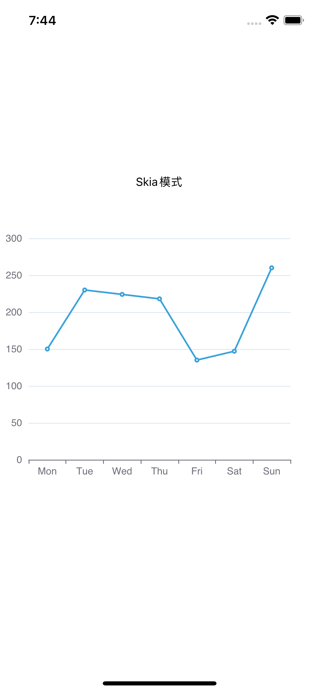

## 前言

平时写图表相关需求，用得最多的图表库就是**echarts**。echarts 在 web 端的表现已经相当成熟，官方对小程序端也提供了解决方案，而在 RN 方面却没有相应支持。市面上搜到的，大多本质还是基于 webview 实现，而我更倾向于基于 RN 的方案，毕竟原生的体验会比 Web 的更好一些。

经过一番寻找发现 [**@wuba/react-native-echarts**](https://wuba.github.io/react-native-echarts/) 满足需求，于是上手试了下，效果还不错 ~ 对实现原理感兴趣的可以看[这里](https://juejin.cn/post/7199529508112711738)

### Tips

- 如果你已经有 APP 包，可以忽略前面的打包流程，直接跳到第 4 步。
- 试用的完整代码放在 github 上了，地址：[https://github.com/iambool/TestApp](https://github.com/iambool/TestApp)

## 详细使用过程如下

### 1、开发环境搭建

本地搭好 RN 开发环境，搭建过程网上一抓一大把，就不赘述了。

### 2、准备 RN 工程

因为是试用，所以我用 expo 新初始化了一个 rn 工程，叫 TestApp。

```
npx create-expo-app TestApp
```


### 3、build App 包

用命令行生成包 ios android app 包。这里 ios 建议用模拟器（不需要配证书），安卓我是连的真机

```
yarn android
yarn ios
```

生成包后，手机看到已经安装了这个应用，就代表成功啦。


### 4、 安装相关依赖

```
yarn add @wuba/react-native-echarts echarts
yarn add @shopify/react-native-skia
yarn add react-native-svg
```

注意，如果你是在已有工程中安装，安装完成后要重新打个新包，不然缺少原生依赖会报错；

### 5、试用 Skia 模式

@wuba/react-native-echarts 支持**两种渲染模式（Skia 和 Svg）**，先用 Skia 试一个简单的图表。大致分为这几个小步骤：

- 引入 echarts、图表组件等依赖
- 注册图表组件
- 创建图表实例，并设置图表的配置（option）
- 页面销毁时要记得同步销毁图表实例

具体代码如下：

```javascript
import { useRef, useEffect } from 'react';
import { View } from 'react-native';
/**
 * 一、引入echarts依赖，这里先试下折线图
 */
import * as echarts from 'echarts/core';
import { LineChart } from 'echarts/charts';
import { GridComponent } from 'echarts/components';
import { SVGRenderer, SkiaChart } from '@wuba/react-native-echarts';

/**
 * 二、注册需要用到的组件
 * SVGRenderer: 是必须注册的
 * LineChart: 因为用的折线图，所以要引入LineChart（如果不知道该引入哪些组件，就直接看报错，报错说缺什么就加什么）
 * GridComponent: 这个就是报错的时候提示，然后我加的hhh
 */
echarts.use([SVGRenderer, LineChart, GridComponent]);

export default () => {
  const skiaRef = useRef(null); // Ref用于保存图表实例
  useEffect(() => {
    /**
     * 四、图表配置
     */
    const option = {
      xAxis: {
        type: 'category',
        data: ['Mon', 'Tue', 'Wed', 'Thu', 'Fri', 'Sat', 'Sun'],
      },
      yAxis: {
        type: 'value',
      },
      series: [
        {
          data: [150, 230, 224, 218, 135, 147, 260],
          type: 'line',
        },
      ],
    };
    let chart;
    if (skiaRef.current) {
      /**
       * 五、初始化图表，指定下宽高
       */
      chart = echarts.init(skiaRef.current, 'light', {
        renderer: 'svg',
        width: 400,
        height: 400,
      });
      chart.setOption(option);
    }
    /**
     * 六、页面关闭后要销毁图表实例
     */
    return () => chart?.dispose();
  }, []);
  return (
    <View className='index'>
      <SkiaChart ref={skiaRef} />
    </View>
  );
};
```

写完摇一摇手机，reload bundle 包时出现了报错：

> ERROR Invariant Violation: requireNativeComponent: "SkiaDomView" was not found in the UIManager.

google 了一下，说是需要[降级](https://stackoverflow.com/questions/74648194/shopify-react-native-skia-with-expo)解决。其实是要跟 expo 版本对应，在安装依赖的时候也会有类似这样的提示，安装提示的版本就可以了


于是按照提示做了版本降级：

```
@shopify/react-native-skia@0.1.157
react-native-svg@13.4.0
```

重新构建 app 后加载出来了，针不戳；（安卓遮住了点，看来应该自适应屏幕宽度）

| iOS                        | Android                         |
| -------------------------- | ------------------------------- |
|  |  |

### 6、试用 Svg 模式

写个复杂点的动态排序柱状图，试试 Svg 模式，给 Svg 和 Skia 做个对比，完整代码看[这里](https://github.com/iambool/TestApp/blob/main/pages/barRace/index.js)。

```javascript
// ...此处省略一些不重要的代码

// 注册需要用到的组件，BarChart-柱状图 LegendComponent-图例
echarts.use([SVGRenderer, BarChart, LegendComponent, GridComponent]);

export default () => {
  const skiaRef = useRef(null);
  const svgRef = useRef(null);

  useEffect(() => {
    // Skia模式
    const skiaChartData = getData(); // 生成图表柱状图数据
    let skiaChart;
    let skiaInter;
    if (skiaRef.current) {
      skiaChart = echarts.init(skiaRef.current, 'light', {
        renderer: 'svg',
        width: 300,
        height: 300,
      });
      skiaChart.setOption(getDefaultOption(skiaChartData));
      setTimeout(function () {
        run(skiaChart, skiaChartData);
      }, 0);
      skiaInter = setInterval(function () {
        run(skiaChart, skiaChartData);
      }, 3000);
    }

    // Svg模式
    const svgChartData = getData();
    let svgChart;
    let svgInter;
    if (svgRef.current) {
      svgChart = echarts.init(svgRef.current, 'light', {
        renderer: 'svg',
        width: 300,
        height: 300,
      });
      svgChart.setOption(getDefaultOption(svgChartData));
      setTimeout(function () {
        run(svgChart, svgChartData);
      }, 0);
      svgInter = setInterval(function () {
        run(svgChart, svgChartData);
      }, 3000);
    }

    return () => {
      skiaChart?.dispose();
      svgChart?.dispose();
      // 定时器得清理掉，不然退出页面后还会运行
      clearInterval(skiaInter);
      clearInterval(svgInter);
    };
  }, []);
  return (
    <View>
      <Text>skia如下</Text>
      <SkiaChart ref={skiaRef} />
      <Text>svg如下</Text>
      <SvgChart ref={svgRef} />
    </View>
  );
};
```

Skia 和 Svg 模式，肉眼看不出明显差别

| iOS                             | Android                             |
| ------------------------------- | ----------------------------------- |
|  |  |

### 7、封装 Chart 组件

效果不错，不过每次使用都要把一堆东西引进去好烦，先简单封装下吧

```javascript
import { useRef, useEffect } from 'react';
import * as echarts from 'echarts/core';
import { BarChart, LineChart, PieChart } from 'echarts/charts';
import {
  DataZoomComponent,
  GridComponent,
  LegendComponent,
  TitleComponent,
  ToolboxComponent,
  TooltipComponent,
} from 'echarts/components';
import {
  SVGRenderer,
  SvgChart as _SvgChart,
  SkiaChart as _SkiaChart,
} from '@wuba/react-native-echarts';
import { Dimensions } from 'react-native';

// 注册需要用到的组件
echarts.use([
  DataZoomComponent,
  SVGRenderer,
  BarChart,
  GridComponent,
  LegendComponent,
  ToolboxComponent,
  TooltipComponent,
  TitleComponent,
  PieChart,
  LineChart,
]);

// 图表默认宽高
const CHART_WIDTH = Dimensions.get('screen').width; // 默认用手机屏幕宽度
const CHART_HEIGHT = 300;

const Chart = ({
  option,
  onInit,
  width = CHART_WIDTH,
  height = CHART_HEIGHT,
  ChartComponent,
}) => {
  const chartRef = useRef(null);

  useEffect(() => {
    let chart;
    if (chartRef.current) {
      chart = echarts.init(chartRef.current, 'light', {
        renderer: 'svg',
        width,
        height,
      });
      option && chart.setOption(option);
      onInit?.(chart);
    }
    return () => chart?.dispose();
  }, [option]);
  return <ChartComponent ref={chartRef} />;
};

const SkiaChart = (props) => <Chart {...props} ChartComponent={_SkiaChart} />;
const SvgChart = (props) => <Chart {...props} ChartComponent={_SvgChart} />;
// 对外只暴露这哥俩就行
export { SkiaChart, SvgChart };
```

### 8、多个图表使用

封装好了，咱就写个多图表同时使用的页面看看效果。这里写了个“电商数据分析”页面，分别有折线图、柱状图、饼图。下方是主要代码，用的 svg 模式，详细代码见[这里](https://github.com/iambool/TestApp/tree/main/pages/ECdata)。

```javascript
// 页面代码
import { SkiaChart } from '../../components/Chart';
import { ScrollView, Text, View } from 'react-native';
import { StatusBar } from 'expo-status-bar';
import { useCallback, useEffect, useState } from 'react';
import {
  defaultActual,
  lineOption,
  salesStatus,
  salesVolume,
  userAnaly,
  getLineData,
} from './contants';
import styles from './styles';
// 开启图表loading
const showChartLoading = (chart) =>
  chart.showLoading('default', {
    maskColor: '#305d9e',
  });
// 关闭图表loading
const hideChartLoading = (chart) => chart.hideLoading();

export default () => {
  const [actual, setActual] = useState(defaultActual); // 记录实时数据

  useEffect(() => {
    // 假设循环请求数据
    const interv = setInterval(() => {
      const newActual = [];
      for (let it of actual) {
        newActual.push({
          ...it,
          num: it.num + Math.floor((Math.random() * it.num) / 100),
        });
      }
      setActual(newActual);
    }, 200);
    return () => clearInterval(interv);
  }, [actual]);

  const onInitLineChart = useCallback((myChart) => {
    showChartLoading(myChart);
    // 模拟数据请求
    setTimeout(() => {
      myChart.setOption({
        series: getLineData,
      });
      hideChartLoading(myChart);
    }, 1000);
  }, []);

  const onInitUserChart = useCallback((myChart) => {
    // 模拟数据请求，跟onInitLineChart类似
  }, []);
  const onInitSaleChart = useCallback((myChart) => {
    // 模拟数据请求，跟onInitLineChart类似
  }, []);
  const onInitStatusChart = useCallback((myChart) => {
    // 模拟数据请求，跟onInitLineChart类似
  }, []);

  const chartList = [
    ['订单走势', lineOption, onInitLineChart],
    ['用户统计', userAnaly, onInitUserChart],
    ['各品类销售统计', salesVolume, onInitSaleChart],
    ['订单状态统计', salesStatus, onInitStatusChart],
  ];

  return (
    <ScrollView style={styles.index}>
      <StatusBar style='light' />
      <View>
        <View style={styles.index_panel_header}>
          <Text style={styles.index_panel_title}>实时数据</Text>
        </View>
        <View style={styles.index_panel_content}>
          {actual.map(({ title, num, unit }) => (
            <View key={title} style={styles.sale_item}>
              <View style={styles.sale_item_cell}>
                <Text style={styles.sale_item_text}>{title}</Text>
              </View>
              <View style={[styles.sale_item_cell, styles.num]}>
                <Text style={styles.sale_item_num}>{num}</Text>
              </View>
              <View style={[styles.sale_item_cell, styles.unit]}>
                <Text style={styles.sale_item_text}>{unit}</Text>
              </View>
            </View>
          ))}
        </View>
      </View>
      {chartList.map(([title, data, callback]) => (
        <View key={title}>
          <View style={styles.index_panel_header}>
            <Text style={styles.index_panel_title}>{title}</Text>
          </View>
          <View style={styles.index_panel_content}>
            <SkiaChart option={data} onInit={callback} />
          </View>
        </View>
      ))}
    </ScrollView>
  );
};
```

重新加载 bundle，看看效果图

| iOS                       | Android                       |
| ------------------------- | ----------------------------- |
|  |  |

渲染出来后，iOS 上交互很丝滑，安卓上交互时感觉偶尔会有卡顿（不会是因为我手机太差吧…）。

再换 Skia 模式看看


emmm 虽然可以，但是好像中文不能正常显示，安卓上中文都没有显示，iOS 则是乱码。看了下文档，目前 skia 在安卓端还不支持中文，在 iOS 端可以通过设置字体为 'PingFang SC'显示中文，比如：

```javascript
const option = {
  title: {
    text: '我是中文',
    textStyle: {
      fontFamily: 'PingFang SC', // 指定字体类型
    },
  },
};
```

但是每个显示中文的地方都要设置字体……那还是先用 svg 吧，我懒。

## 总结

使用了一段时间后，我总结了下：

- 支持度上，@wuba/react-native-echarts 除了 GL 系列、地图类图表还不支持外，其余类型的图表都支持，对于日常业务来说已经非常 enough 了。echarts 各种类型的图表实现，都可以在[taro-playground](https://github.com/wuba/taro-playground)上找到；
- 交互上，iOS 很丝滑，安卓有时会出现掉帧的情况；
- 性能上，官方报告显示优于 react-native-echarts-pro。
  - 个人试了下，不是超大数据量就不会有什么问题，但是数据量太大的时候（比如画大数据量的热力图），渲染速度明显下降了很多，这是一个等待官方去优化的点。
  - 另外页面内图表多的话，真机调试时加载速度会变慢，建议先用模拟器。
- 中文支持，Svg 模式支持中文，但 Skia 模式目前还不可以。

以上仅代表个人观点，有问题欢迎交流。
