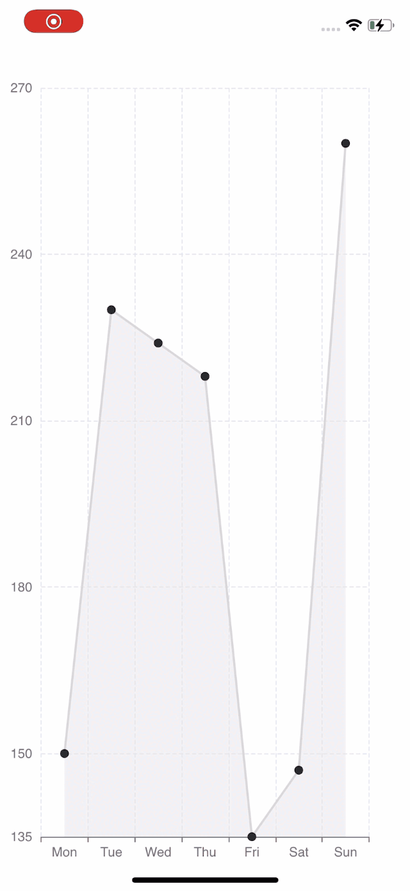

# 写一个自适应尺寸的图表

在业务代码中，有时候我们不希望直接定义固定尺寸的图表，而是让 echarts 图表自动适配容器尺寸。这里我们写一个简单的例子来告诉大家如何实现。

1. 首先，像之前的案例一样，导入图表依赖。这里我们用到 LineChart 所以只引入它，实际情况下根据自己的使用图表进行引入。

```tsx
import React, { useState, useRef, useEffect } from "react";
import { StyleSheet, View, Dimensions } from "react-native";
import * as echarts from "echarts/core";
import { LineChart } from "echarts/charts";
import { GridComponent } from "echarts/components";
import { SVGRenderer, SkiaChart } from "@wuba/react-native-echarts";
```

2. 使用 echarts.use 来注册渲染器和图表。

```tsx
echarts.use([SVGRenderer, LineChart, GridComponent]);
```

3. 为 SkiaChart 组件创建一个 Ref, 并使用 View 容器装它。通过 onLayout 获取容器的宽高后续对 echarts 图表进行赋值。

```tsx
export default function App() {
  const skiaRef = useRef<any>(null);
  const [chartWidth, setChartWidth] = useState<number>(0);
  const [chartHeight, setChartHeight] = useState<number>(0);
}
```

4. 编写图表的选项。

```tsx
const option = {
  xAxis: {
    type: "category",
    data: ["Mon", "Tue", "Wed", "Thu", "Fri", "Sat", "Sun"],
    splitLine: {
      show: true,
      lineStyle: {
        type: "dashed",
      },
    },
  },
  yAxis: {
    type: "value",
    min: "dataMin",
    splitLine: {
      show: true,
      lineStyle: {
        type: "dashed",
      },
    },
  },
  series: [
    {
      data: [150, 230, 224, 218, 135, 147, 260],
      type: "line",
      areaStyle: {
        color: "rgba(230, 231, 231,0.8)",
      },
      lineStyle: {
        color: "#d6d6d7",
      },
      symbol: "circle",
      symbolSize: 8,
      itemStyle: {
        color: "#24262a",
      },
    },
  ],
};
```

5. 创建一个图表实例并设置选项。

```tsx
let chart = echarts.init(skiaRef.current, "light", {
  renderer: "svg",
  width: chartWidth,
  height: chartHeight,
});
chart.setOption(option);
```

经过以上的步骤，我们已经可以得到一个与父级容器尺寸一致的初始图表了。如果我们还需要图表根据外部条件变化来适应尺寸，则还需要做一些事，这里我们以手机屏幕尺寸变化为例展示如何在手机宽高尺寸变化时图表自适应尺寸。

6. 注册 Dimensions 的 change 事件，来监听屏幕尺寸的变化

```tsx
const handleDimensionsChange = (e) => {
  const { width, height } = e.screen;
};

useEffect(() => {
  Dimensions.addEventListener("change", handleDimensionsChange);
  return () => {
    Dimensions.removeEventListener("change", handleDimensionsChange);
  };
}, []);
```

7. 获取到屏幕尺寸变化, 重置图表的尺寸。

```tsx
const handleDimensionsChange = (e) => {
  const { width, height } = e.screen;
  setChartWidth(width);
  setChartHeight(height);
};
```

8. 重新绘制图表

```tsx
useEffect(() => {
  chartRef.current.resize({
    width: chartWidth,
    height: chartHeight,
  });
}, [chartWidth, chartHeight]);
```

完整代码如下：

```tsx
import React, { useState, useRef, useEffect } from "react";
import { StyleSheet, View, Dimensions } from "react-native";
import * as echarts from "echarts/core";
import { LineChart } from "echarts/charts";
import { GridComponent } from "echarts/components";
import { SVGRenderer, SkiaChart } from "@wuba/react-native-echarts";

echarts.use([SVGRenderer, LineChart, GridComponent]);

export default function App() {
  const skiaRef = useRef<any>(null);
  const chartRef = useRef<any>(null);
  const [chartWidth, setChartWidth] = useState<number>(0);
  const [chartHeight, setChartHeight] = useState<number>(0);

  useEffect(() => {
    Dimensions.addEventListener("change", handleDimensionsChange);
    return () => {
      Dimensions.removeEventListener("change", handleDimensionsChange);
    };
  }, []);

  useEffect(() => {
    const option = {
      xAxis: {
        type: "category",
        data: ["Mon", "Tue", "Wed", "Thu", "Fri", "Sat", "Sun"],
        splitLine: {
          show: true,
          lineStyle: {
            type: "dashed",
          },
        },
      },
      yAxis: {
        type: "value",
        min: "dataMin",
        splitLine: {
          show: true,
          lineStyle: {
            type: "dashed",
          },
        },
      },
      series: [
        {
          data: [150, 230, 224, 218, 135, 147, 260],
          type: "line",
          areaStyle: {
            color: "rgba(230, 231, 231,0.8)",
          },
          lineStyle: {
            color: "#d6d6d7",
          },
          symbol: "circle", // 设置拐点的图形为圆形
          symbolSize: 8, // 设置拐点的大小
          itemStyle: {
            color: "#24262a",
          },
        },
      ],
    };
    let chart: any;
    if (skiaRef.current) {
      chart = echarts.init(skiaRef.current, "light", {
        renderer: "svg",
        width: chartWidth,
        height: chartHeight,
      });
      chart.setOption(option);
      chartRef.current = chart;
    }
    return () => chart?.dispose();
  }, []);

  // 监听尺寸变化 重置图表
  useEffect(() => {
    chartRef.current.resize({
      width: chartWidth,
      height: chartHeight,
    });
  }, [chartWidth, chartHeight])

  // 获取容器的宽高
  const handleLayout = (e) => {
    const { width, height } = e.nativeEvent.layout;
    setChartWidth(width);
    setChartHeight(height);
  };
  // 屏幕方向改变以后
  const handleDimensionsChange = (e) => {
    const { width, height } = e.screen;
    setChartWidth(width);
    setChartHeight(height);
  };
  return (
    <View style={styles.container} onLayout={handleLayout}>
      <SkiaChart ref={skiaRef} />
    </View>
  );
}

const styles = StyleSheet.create({
    container: {
        flex: 1,
        alignItems: 'center',
        justifyContent: 'center',
    },
}
```

这是最终的效果：

| iOS                      | Android                          |
| ------------------------ | -------------------------------- |
|  |  |

如果你想使用 react-native-skia，只需将 SvgChart 替换为 SkiaChart。

更多图表配置，可以参考[echarts 文档](https://echarts.apache.org/zh/option.html#title)。
