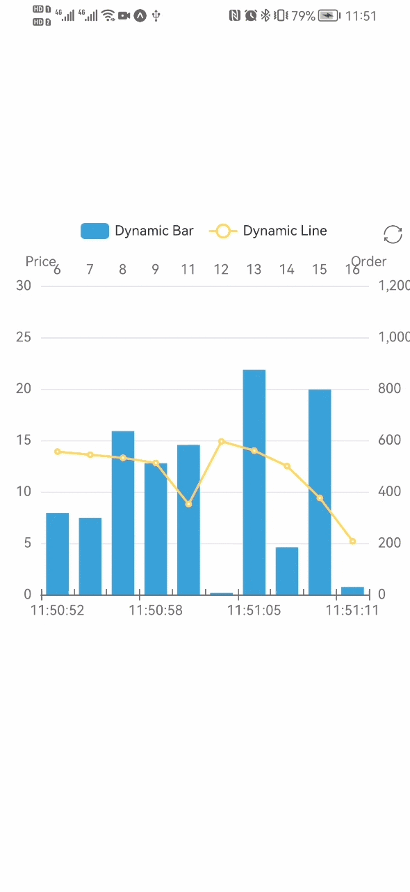

# 写一个动态变化的图表

我们尝试用 Svg 模式画一个展示动态数据变化的图表，包含柱状图和折线图。它在浏览器端的效果在[这里](https://echarts.apache.org/examples/zh/editor.html?c=dynamic-data)。

1. 首先，像之前的案例一样，导入图表依赖。

   柱状图需要引入 BarChart, 其余用到的组件有 ToolboxComponent, TooltipComponent, LegendComponent, DataZoomComponent。

```tsx
import { BarChart } from 'echarts/charts';
import {
  ToolboxComponent,
  LegendComponent,
  TooltipComponent,
  DataZoomComponent,
} from 'echarts/components';
import { SVGRenderer, SvgChart } from '@wuba/react-native-echarts';
```

如果不知道该引入什么组件，遇到报错可以参考[这里](/docs/trouble-shooting/troubleshooting/#error-echarts-component-xxx-is-used-but-not-imported)

2. 使用 echarts.use 来注册渲染器和图表。

```tsx
echarts.use([
  SVGRenderer,
  BarChart,
  ToolboxComponent,
  TooltipComponent,
  LegendComponent,
  DataZoomComponent,
]);
```

3. 为 SvgChart 组件创建一个 Ref。

```tsx
export default function App() {
  const svgRef = useRef<any>(null);
  return <SvgChart ref={svgRef} />;
}
```

4. 准备 option 及数据切换的方法。

```tsx
const categories = (function () {
  let now = new Date();
  let res = [];
  let len = 10;
  while (len--) {
    res.unshift(now.toLocaleTimeString().replace(/^\D*/, ''));
    now = new Date(+now - 2000);
  }
  return res;
})();
const categories2 = (function () {
  let res = [];
  let len = 10;
  while (len--) {
    res.push(10 - len - 1);
  }
  return res;
})();
const data = (function () {
  let res = [];
  let len = 10;
  while (len--) {
    res.push(Math.round(Math.random() * 1000));
  }
  return res;
})();
const data2 = (function () {
  let res = [];
  let len = 0;
  while (len < 10) {
    res.push(+(Math.random() * 10 + 5).toFixed(1));
    len++;
  }
  return res;
})();
const option = {
  tooltip: {
    trigger: 'axis',
    axisPointer: {
      type: 'cross',
      label: {
        backgroundColor: '#283b56',
      },
    },
  },
  legend: {},
  toolbox: {
    show: true,
    feature: {
      dataView: { show: false, readOnly: false },
      restore: {},
    },
  },
  dataZoom: {
    show: false,
    start: 0,
    end: 100,
  },
  xAxis: [
    {
      type: 'category',
      boundaryGap: true,
      data: categories,
    },
    {
      type: 'category',
      boundaryGap: true,
      data: categories2,
    },
  ],
  yAxis: [
    {
      type: 'value',
      scale: true,
      name: 'Price',
      max: 30,
      min: 0,
      boundaryGap: [0.2, 0.2],
    },
    {
      type: 'value',
      scale: true,
      name: 'Order',
      max: 1200,
      min: 0,
      boundaryGap: [0.2, 0.2],
    },
  ],
  series: [
    {
      name: 'Dynamic Bar',
      type: 'bar',
      xAxisIndex: 1,
      yAxisIndex: 1,
      data: data,
    },
    {
      name: 'Dynamic Line',
      type: 'line',
      data: data2,
    },
  ],
};
```

5. 创建一个图表实例并设置选项。

```tsx
let chart = echarts.init(svgRef.current, 'light', {
  renderer: 'svg',
  width: E_WIDTH,
  height: E_HEIGHT,
});
chart.setOption(option);
```

6. 实例创建后，周期更新数据，实现动画效果。

```tsx
let count = 11;
inter = setInterval(function () {
  let axisData = new Date().toLocaleTimeString().replace(/^\D*/, '');

  data.shift();
  data.push(Math.round(Math.random() * 1000));
  data2.shift();
  data2.push(+(Math.random() * 10 + 5).toFixed(1));

  categories.shift();
  categories.push(axisData);
  categories2.shift();
  categories2.push(count++);

  chart.setOption({
    xAxis: [
      {
        data: categories,
      },
      {
        data: categories2,
      },
    ],
    series: [
      {
        data: data,
      },
      {
        data: data2,
      },
    ],
  });
}, 2100);
```

7. 使用 useEffect 来确保图表只被初始化一次。并在组件卸载时释放图表和定时器。

```tsx
useEffect(() => {
  return () => {
    chart?.dispose();
    clearInterval(inter);
  };
}, []);
```

这就是了! 这里是代码：

```tsx
import { useRef, useEffect } from 'react';
import * as echarts from 'echarts/core';
import { Dimensions, StyleSheet, View } from 'react-native';
import { BarChart } from 'echarts/charts';
import {
  ToolboxComponent,
  LegendComponent,
  TooltipComponent,
  DataZoomComponent,
} from 'echarts/components';
import { SVGRenderer, SvgChart } from '@wuba/react-native-echarts';

echarts.use([
  SVGRenderer,
  BarChart,
  ToolboxComponent,
  TooltipComponent,
  LegendComponent,
  DataZoomComponent,
]);

const E_HEIGHT = 400;
const E_WIDTH = Dimensions.get('screen').width;

const categories = (function () {
  let now = new Date();
  let res = [];
  let len = 10;
  while (len--) {
    res.unshift(now.toLocaleTimeString().replace(/^\D*/, ''));
    now = new Date(+now - 2000);
  }
  return res;
})();
const categories2 = (function () {
  let res = [];
  let len = 10;
  while (len--) {
    res.push(10 - len - 1);
  }
  return res;
})();
const data = (function () {
  let res = [];
  let len = 10;
  while (len--) {
    res.push(Math.round(Math.random() * 1000));
  }
  return res;
})();
const data2 = (function () {
  let res = [];
  let len = 0;
  while (len < 10) {
    res.push(+(Math.random() * 10 + 5).toFixed(1));
    len++;
  }
  return res;
})();
const option = {
  tooltip: {
    trigger: 'axis',
    axisPointer: {
      type: 'cross',
      label: {
        backgroundColor: '#283b56',
      },
    },
  },
  legend: {},
  toolbox: {
    show: true,
    feature: {
      dataView: { show: false, readOnly: false },
      restore: {},
    },
  },
  dataZoom: {
    show: false,
    start: 0,
    end: 100,
  },
  xAxis: [
    {
      type: 'category',
      boundaryGap: true,
      data: categories,
    },
    {
      type: 'category',
      boundaryGap: true,
      data: categories2,
    },
  ],
  yAxis: [
    {
      type: 'value',
      scale: true,
      name: 'Price',
      max: 30,
      min: 0,
      boundaryGap: [0.2, 0.2],
    },
    {
      type: 'value',
      scale: true,
      name: 'Order',
      max: 1200,
      min: 0,
      boundaryGap: [0.2, 0.2],
    },
  ],
  series: [
    {
      name: 'Dynamic Bar',
      type: 'bar',
      xAxisIndex: 1,
      yAxisIndex: 1,
      data: data,
    },
    {
      name: 'Dynamic Line',
      type: 'line',
      data: data2,
    },
  ],
};

export default () => {
  const svgRef = useRef(null);

  useEffect(() => {
    let chart;
    let inter;
    if (svgRef.current) {
      chart = echarts.init(svgRef.current, 'light', {
        renderer: 'svg',
        width: E_WIDTH,
        height: E_HEIGHT,
      });
      chart.setOption(option);

      let count = 11;
      inter = setInterval(function () {
        let axisData = new Date().toLocaleTimeString().replace(/^\D*/, '');

        data.shift();
        data.push(Math.round(Math.random() * 1000));
        data2.shift();
        data2.push(+(Math.random() * 10 + 5).toFixed(1));

        categories.shift();
        categories.push(axisData);
        categories2.shift();
        categories2.push(count++);

        chart.setOption({
          xAxis: [
            {
              data: categories,
            },
            {
              data: categories2,
            },
          ],
          series: [
            {
              data: data,
            },
            {
              data: data2,
            },
          ],
        });
      }, 2100);
    }
    return () => {
      chart?.dispose();
      clearInterval(inter);
    };
  }, []);
  return (
    <View style={styles.container}>
      <SvgChart ref={svgRef} />
    </View>
  );
};

const styles = StyleSheet.create({
  container: {
    flex: 1,
    alignItems: 'center',
    justifyContent: 'center',
  },
});
```

这是最终的效果：

| iOS                            | Android                                |
| ------------------------------ | -------------------------------------- |
|  |  |

如果你想使用 react-native-skia，只需将 SvgChart 替换为 SkiaChart，然后使用 `skia` 作为渲染器。

更多图表配置，可以参考[echarts 文档](https://echarts.apache.org/zh/option.html#title)。
