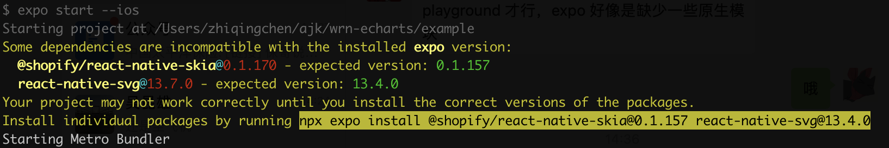

# 常见错误

<!-- - ### skia/svg 版本与 expo 内置版本对应 -->

- ### ERROR Invariant Violation: requireNativeComponent: "SkiaDomView" was not found in the UIManager.

  如果使用了 expo，则需要安装与 expo 内置版本对应的 skia/svg 版本，否则会出现上述报错。如果不确定应该安装哪个版本，可以根据 expo 启动时推荐的版本安装，比如：

  

<!-- 组件未注册 -->

- ### ERROR [ECharts] Component XXX is used but not imported.
  上述报错说明 XXX 组件在图表中使用了但还未注册。图表中使用到的组件需要手动注册，方式如下：
  ```js
  import { XXX } from 'echarts/components';
  echarts.use([XXX]);
  ```

<!-- ### 初始化时没有series -->

- ### ERROR [ECharts] Unknown series undefined
  在图表还原(restore)时出现上述错误，很可能是在图表对象初始化时，option 传入的是空的对象，或传入的对象中没有 series 字段，比如这样的写法 `chartInstance.setOption({})`。初始化时，option 应尽量传入 series 配置。
