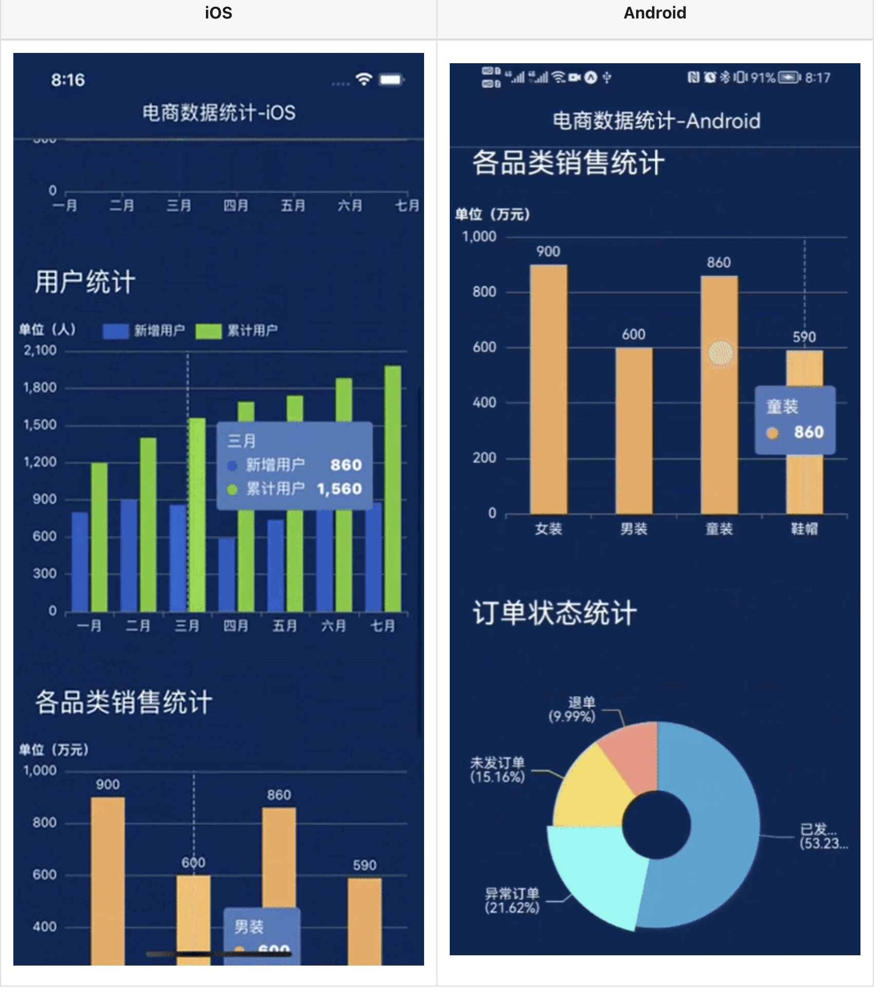

寫作與圖表相關需求最常用的圖表庫是**echarts**。 echarts 在網站上的性能非常成熟，並提供了官方解決方案以支持小程序端，但在 RN 中卻沒有相應的支援。市場上，大多數搜索仍然基於 webview 實現的本質，而我更喜歡基於 RN 的程式，畢竟原生體驗會比 Web 更好。

後來發現 [**@wuba/react-native-echarts**](https://wuba.github.io/react-native-echarts/) 能夠滿足需求，因此嘗試使用它，結果非常出色。對於那些對實現原理感興趣的人，請點擊[這裡](https://wuba.github.io/react-native-echarts/zh-hant/blog/using-apache-echarts-in-react-native)



<!--truncate-->

### 提示

- 如果您已經有一個 APP 包，可以忽略之前的打包過程，直接從第 4 步開始。
- 試用的完整代碼在 GitHub 上：[https://github.com/iambool/TestApp](https://github.com/iambool/TestApp)

## 使用步驟如下

### 第 1 步：設置開發環境

搭建本地 RN 開發環境的過程在網上已經有很多資料，這裡就不再贅述了。您可以在 Google 上搜索相關資料。

### 第 2 步：創建 RN 項目

由於這是一個試用，我使用了 Expo 來新建一個名為 TestApp 的 RN 項目。

```
npx create-expo-app TestApp
```


### 第 3 步：在移動設備上構建應用程序

使用命令行生成 iOS 和 Android 的應用程序包。建議在 iOS 上使用模擬器（無需匹配證書），而我則連接了真實的 Android 手機。

```
yarn android
yarn ios
```

生成應用程序包後，手機上已經安裝了如下的應用程序，這意味著構建成功。


### 第 4 步：安裝相關依賴

```
yarn add @wuba/react-native-echarts echarts
yarn add @shopify/react-native-skia
yarn add react-native-svg
```

> 注意：如果您在現有項目中安裝，安裝完成後必須重新構建一個新的包，否則缺少原生依賴將報錯。

### 第 5 步：試用 Skia 模式

@wuba/react-native-echarts 支持兩種**渲染模式（Skia 和 Svg）**，先試用一個簡單的 Skia 模式的圖表。具體分為以下幾個小步驟：

- 引入 echarts、圖表組件等依賴。
- 註冊圖表組件。
- 創建圖表實例並設置選項。
- 在頁面銷毀時同步銷毀圖表實例。

具體代碼如下：

```javascript
import { useRef, useEffect } from 'react';
import { View } from 'react-native';
/**
 * 1. 引入 echarts 依賴，這個例子先試用折線圖
 */
import * as echarts from 'echarts/core';
import { LineChart } from 'echarts/charts';
import { GridComponent } from 'echarts/components';
import SkiaChart, { SVGRenderer } from '@wuba/react-native-echarts/skiaChart';

/**
 * 2. 註冊所需的組件
 * SVGRenderer：必須註冊
 * LineChart：因為我們要展示折線圖，所以要引入 LineChart
 *      - 如果不知道要引入哪些組件，可以看一下報錯信息，缺少什麼就引入什麼
 * GridComponent：這是報錯時的提示，然後我就加上了，哈哈
 */
echarts.use([SVGRenderer, LineChart, GridComponent]);

export default () => {
  const skiaRef = useRef(null); // 保存圖表實例的 ref
  useEffect(() => {
    /**
     * 3. 圖表選項
     */
    const option = {
      xAxis: {
        type: 'category',
        data: ['Mon', 'Tue', 'Wed', 'Thu', 'Fri', 'Sat', 'Sun'],
      },
      yAxis: {
        type: 'value',
      },
      series: [
        {
          data: [150, 230, 224, 218, 135, 147, 260],
          type: 'line',
        },
      ],
    };
    let chart;
    if (skiaRef.current) {
      /**
       * 4. 初始化圖表，指定寬高
       */
      chart = echarts.init(skiaRef.current, 'light', {
        renderer: 'svg',
        width: 400,
        height: 400,
      });
      chart.setOption(option);
    }
    /**
     * 5. 在頁面銷毀時銷毀圖表實例
     */
    return () => chart?.dispose();
  }, []);
  return (
    <View className='index'>
      <SkiaChart ref={skiaRef} />
    </View>
  );
};
```

編寫代碼後，搖晃手機並重新加載 bundle 包，報錯了：

> ERROR Invariant Violation: requireNativeComponent: "SkiaDomView" was not found in the UIManager.

我在 Google 上搜索了一下，發現需要進行[版本降級](https://stackoverflow.com/questions/74648194/shopify-react-native-skia-with-expo)，需要對應到 expo 的版本，安裝依賴時會有類似的提示，安裝提示的版本就可以了。


於是我按照提示進行了版本降級：

```
@shopify/react-native-skia@0.1.157
react-native-svg@13.4.0
```

重新構建應用程序後，成功加載了。不過 Android 把點給蓋住了，看來應該要屏幕寬度自適應。

| iOS                    | Android                        |
| ---------------------- | ------------------------------ |
|  |  |

### 第 6 步：試用 Svg 模式

用 Svg 模式寫一個更複雜的動態排序柱狀圖，順便比較一下 Svg 和 Skia 的效果。完整代碼在[這裡](https://github.com/iambool/TestApp/blob/main/pages/barRace/index.js)。

```javascript
import SvgChart, { SVGRenderer } from '@wuba/react-native-echarts/svgChart';
// ...這裡省略了一些不重要的代碼

// 註冊所需的組件，如 BarChart 和 LegendComponent
echarts.use([SVGRenderer, BarChart, LegendComponent, GridComponent]);

export default () => {
  const skiaRef = useRef(null);
  const svgRef = useRef(null);

  useEffect(() => {
    // Skia 模式
    const skiaChartData = getData(); // 生成圖表柱狀圖數據
    let skiaChart;
    let skiaInter;
    if (skiaRef.current) {
      skiaChart = echarts.init(skiaRef.current, 'light', {
        renderer: 'svg',
        width: 300,
        height: 300,
      });
      skiaChart.setOption(getDefaultOption(skiaChartData));
      setTimeout(function () {
        run(skiaChart, skiaChartData);
      }, 0);
      skiaInter = setInterval(function () {
        run(skiaChart, skiaChartData);
      }, 3000);
    }

    // Svg 模式
    const svgChartData = getData();
    let svgChart;
    let svgInter;
    if (svgRef.current) {
      svgChart = echarts.init(svgRef.current, 'light', {
        renderer: 'svg',
        width: 300,
        height: 300,
      });
      svgChart.setOption(getDefaultOption(svgChartData));
      setTimeout(function () {
        run(svgChart, svgChartData);
      }, 0);
      svgInter = setInterval(function () {
        run(svgChart, svgChartData);
      }, 3000);
    }

    return () => {
      skiaChart?.dispose();
      svgChart?.dispose();
      // 定時器要清理掉，否則退出頁面後還會繼續運行
      clearInterval(skiaInter);
      clearInterval(svgInter);
    };
  }, []);
  return (
    <View>
      <Text>skia</Text>
      <SkiaChart ref={skiaRef} />
      <Text>svg</Text>
      <SvgChart ref={svgRef} />
    </View>
  );
};
```

我用肉眼看不出這兩種模式有什麼區別。

| iOS                                | Android                                |
| ---------------------------------- | -------------------------------------- |
|  |  |

### 第 7 步：封裝 Chart 組件

到目前為止效果還不錯，但每次都要引入一堆東西，有點麻煩。我們來簡單封裝一下：

```javascript
import { useRef, useEffect } from 'react';
import * as echarts from 'echarts/core';
import { BarChart, LineChart, PieChart } from 'echarts/charts';
import {
  DataZoomComponent,
  GridComponent,
  LegendComponent,
  TitleComponent,
  ToolboxComponent,
  TooltipComponent,
} from 'echarts/components';
import {
  SVGRenderer,
  SvgChart as _SvgChart,
  SkiaChart as _SkiaChart,
} from '@wuba/react-native-echarts';
// 注意：如果只安裝了 svg 或 skia 其中一個，需要分別引入如下
// import _SkiaChart, { SVGRenderer } from '@wuba/react-native-echarts/skiaChart';
// import _SvgChart, { SVGRenderer } from '@wuba/react-native-echarts/svgChart';

import { Dimensions } from 'react-native';

// 註冊所需的組件
echarts.use([
  DataZoomComponent,
  SVGRenderer,
  BarChart,
  GridComponent,
  LegendComponent,
  ToolboxComponent,
  TooltipComponent,
  TitleComponent,
  PieChart,
  LineChart,
]);

// 圖表的默認寬度和高度
const CHART_WIDTH = Dimensions.get('screen').width; // 默認使用手機屏幕寬度
const CHART_HEIGHT = 300;

const Chart = ({
  option,
  onInit,
  width = CHART_WIDTH,
  height = CHART_HEIGHT,
  ChartComponent,
}) => {
  const chartRef = useRef(null);

  useEffect(() => {
    let chart;
    if (chartRef.current) {
      chart = echarts.init(chartRef.current, 'light', {
        renderer: 'svg',
        width,
        height,
      });
      option && chart.setOption(option);
      onInit?.(chart);
    }
    return () => chart?.dispose();
  }, [option]);
  return <ChartComponent ref={chartRef} />;
};

const SkiaChart = (props) => <Chart {...props} ChartComponent={_SkiaChart} />;
const SvgChart = (props) => <Chart {...props} ChartComponent={_SvgChart} />;
// 只導出這兩個組件
export { SkiaChart, SvgChart };
```

### 第 8 步：使用多個圖表

封裝好之後，我們來寫一個包含多個圖表的頁面，看看效果如何。這裡以“電商數據分析”為例，包含了一個折線圖、柱狀圖和餅圖。以下是使用 svg 模式編寫的主要代碼，詳細代碼可以點擊[這裡](https://github.com/iambool/TestApp/tree/main/pages/ECdata)查看。

```jsx
import { SkiaChart } from '../../components/Chart';
import { ScrollView, Text, View } from 'react-native';
import { StatusBar } from 'expo-status-bar';
import { useCallback, useEffect, useState } from 'react';
import {
  defaultActual,
  lineOption,
  salesStatus,
  salesVolume,
  userAnaly,
  getLineData,
} from './contants';
import styles from './styles';
// 打開圖表的 loading 效果
const showChartLoading = (chart) =>
  chart.showLoading('default', {
    maskColor: '#305d9e',
  });
// 關閉圖表的 loading 效果
const hideChartLoading = (chart) => chart.hideLoading();

export default () => {
  const [actual, setActual] = useState(defaultActual); // 保存實時數據

  useEffect(() => {
    // 假設是一個定時請求數據的操作
    const interv = setInterval(() => {
      const newActual = [];
      for (let it of actual) {
        newActual.push({
          ...it,
          num: it.num + Math.floor((Math.random() * it.num) / 100),
        });
      }
      setActual(newActual);
    }, 200);
    return () => clearInterval(interv);
  }, [actual]);

  const onInitLineChart = useCallback((myChart) => {
    showChartLoading(myChart);
    // 模擬數據請求
    setTimeout(() => {
      myChart.setOption({
        series: getLineData,
      });
      hideChartLoading(myChart);
    }, 1000);
  }, []);

  const onInitUserChart = useCallback((myChart) => {
    // 模擬數據請求，類似 onInitLineChart
  }, []);
  const onInitSaleChart = useCallback((myChart) => {
    // 模擬數據請求，類似 onInitLineChart
  }, []);
  const onInitStatusChart = useCallback((myChart) => {
    // 模擬數據請求，類似 onInitLineChart
  }, []);

  const chartList = [
    ['订单走势', lineOption, onInitLineChart],
    ['用户统计', userAnaly, onInitUserChart],
    ['各品类销售统计', salesVolume, onInitSaleChart],
    ['订单状态统计', salesStatus, onInitStatusChart],
  ];

  return (
    <ScrollView style={styles.index}>
      <StatusBar style='light' />
      <View>
        <View style={styles.index_panel_header}>
          <Text style={styles.index_panel_title}>实时数据</Text>
        </View>
        <View style={styles.index_panel_content}>
          {actual.map(({ title, num, unit }) => (
            <View key={title} style={styles.sale_item}>
              <View style={styles.sale_item_cell}>
                <Text style={styles.sale_item_text}>{title}</Text>
              </View>
              <View style={[styles.sale_item_cell, styles.num]}>
                <Text style={styles.sale_item_num}>{num}</Text>
              </View>
              <View style={[styles.sale_item_cell, styles.unit]}>
                <Text style={styles.sale_item_text}>{unit}</Text>
              </View>
            </View>
          ))}
        </View>
      </View>
      {chartList.map(([title, data, callback]) => (
        <View key={title}>
          <View style={styles.index_panel_header}>
            <Text style={styles.index_panel_title}>{title}</Text>
          </View>
          <View style={styles.index_panel_content}>
            <SkiaChart option={data} onInit={callback} />
          </View>
        </View>
      ))}
    </ScrollView>
  );
};
```

重新加載 bundle 包，看看效果

| iOS                          | Android                          |
| ---------------------------- | -------------------------------- |
|  |  |

渲染後，iOS 上的互動非常流暢，而 Android 上的互動偶爾會感覺有點卡頓（不是因為我的手機太差了吧？...）

再試試 Skia 模式


嗯，雖然可以，但似乎無法正確顯示中文，Android 上無法顯示中文，而 iOS 則是一團亂碼。在閱讀文檔後，我發現 skia 目前不支持 Android 端的中文顯示，我們可以通過將字體設置為 'PingFang SC' 來在 iOS 上顯示中文，例如：

```javascript
const option = {
  title: {
    text: '我是中文',
    textStyle: {
      fontFamily: 'PingFang SC', // 設置字體類型
    },
  },
};
```

但是每個顯示中文的地方都需要設置字體... 要不就先使用 Svg，我有點懶。

## 總結

使用一段時間後，我總結了以下內容：

- 在支持方面，@wuba/react-native-echarts 支持除了 GL 系列和地圖圖表之外的所有類型的圖表，這對於日常業務來說已經非常足夠了。實現各種圖表的代碼可以在 [taro-playground](https://github.com/wuba/taro-playground) 中找到。
- 互動方面，iOS 非常流暢，Android 偶爾會有幀率下降的情況。
- 性能方面：官方報告的性能比其他解決方案更好。
  - 我試過，數據量不是很大時不會有任何問題，但是當數據量太大時（例如繪製大量數據的熱力圖），渲染速度明顯下降了很多，這是一個等待官方優化的點。
  - 此外，如果頁面上有很多圖表，使用真機調試時加載速度會很慢，建議先使用模擬器。
- 中文支持，Svg 模式支持中文，但 Skia 模式目前不可用。

以上僅為個人觀點，歡迎交流任何問題。

