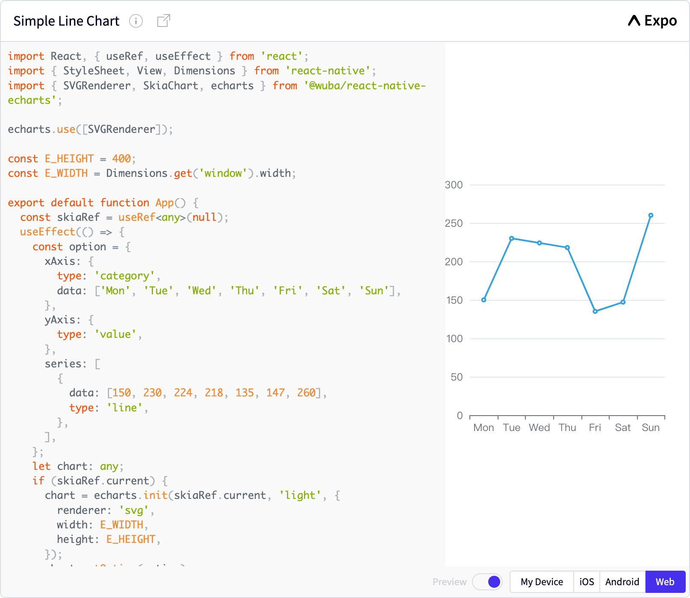

我們很高興地宣布 React Native Echarts 的官方網站已經上線！

我們會不斷更新網站，為您提供有關我們項目的最新信息。在網站上，您將找到完整的文檔、線上編輯示例以及常見問題的解決方案和其他相關信息。

## 全新的標誌和設計


我們設計了一個反映我們項目關鍵特性的標誌：高效、簡潔和技術。該標誌基於極坐標柱狀圖，並轉化為現代和技術風格。

希望您喜歡！
<!--truncate-->
## 為 React Native 库構建現代文檔網站

除了網站上線的信息，我還將介紹如何構建一個現代文檔網站。如果您有興趣為您的開源項目構建文檔網站，本指南可以作為一個很好的參考。

### 使用 Docusaurus 初始化


要構建一個現代文檔網站，第一步是使用 [Docusaurus](https://docusaurus.io/) 初始化您的項目。Docusaurus 提供了一個快速、簡單構建文檔網站的框架。您可以使用以下命令初始化您的項目。

```bash
npx create-docusaurus@latest my-website classic --typescript
```

更多信息，請參閱 [Docusaurus 入門指南](https://docusaurus.io/docs/installation)。

### Ember Expo Snack

[Expo Snack](https://snack.expo.dev/) 是一個在瀏覽器中運行 React Native 應用程序的開源平台。如果您正在為 React Native 库構建網站，這是一個很好的功能，可以幫助開發人員輕鬆地嘗試和測試代碼，而無需在本地下載任何東西。

在 Docusaurus 項目中集成 Snack 可能會有一些挑戰。我參考了這個 [issue](https://github.com/facebook/docusaurus/issues/3966) 和 [react-native-website](https://github.com/facebook/react-native-website) 的源代碼。

集成 Snack 需要以下步驟。

- 編寫一個名為 `@react-native-website/remark-snackplayer` 的 remarkPlugins 調用。該插件在編譯 markdown 文件時，訪問所有 `code` 节點，並將 `node.lang == 'SnackPlayer'` 的節點替換為 SnackPlayer `div`。
- 編寫一個名為 `snackPlayerInitializer` 的客戶端模塊。該模塊在適當的時間監聽客戶端事件，並調用 `initSnackPlayers`、`updateSnacksTheme`。
- 修改配置文件 `docusaurus.config.js`，將 `@react-native-website/remark-snackplayer` 添加到 remarkPlugins，將 `snackPlayerInitializer` 添加到 clientModules，並將 `https://snack.expo.dev/embed.js` 添加到 `scripts`。
- 在 `src/css/custom.css` 文件中，為 snack-player 定義一些樣式。

現在，您有了一個在線編輯器，如下所示。

```SnackPlayer name=Hello%20World
import { Text } from 'react-native';
export default function() {
  return (
    <Text>Hello, world!</Text>
  );
}
```

如果您對實現原理感興趣，可以查看我們的 [commit](https://github.com/wuba/react-native-echarts/commit/4ff00c01066b0d7eca7f243e3ac3e07de7dbd902) 以及 [Including Snacks in your documentation](https://github.com/expo/snack/blob/main/docs/embedding-snacks.md)。

### 使用 SnackPlayer 組件

Ember Expo Snack 很酷，但有時我想將代碼放在一個 tsx 文件中，然後將其導入到需要它的文章中。這樣，我的代碼更容易編輯和重用。

除了在線編輯器之外，我們還提供了一個 SnackPlayer 組件，可以像下面這樣使用。

```tsx
import SnackPlayer from '@site/src/components/SnackPlayer';
import SimpleLineChart from '!!raw-loader!@site/src/snippets/simple-line-chart/index.tsx';

<SnackPlayer name="Simple Line Chart">{SimpleLineChart}</SnackPlayer>
```

感謝 Webpack 的 raw-loader，您可以將任何代碼文件作為原始文本導入，然後將其插入到代碼塊中。該組件的實現也非常簡單，接受與 Snack 相關的 props 和代碼字符串，並將它們轉換為 SnackPlayer `div`，參考 [this commit](https://github.com/wuba/react-native-echarts/commit/745d5c2d21bc03a42071af4e1da978ec93dbde9e)。



現在，您可以在 @wuba/react-native-echarts 上使用線上編輯器，[立即試試](/docs/expo-snacks/simple-line-chart)。我們計劃在未來提供更多用例。

如果您想自定義自己的組件，請參閱 [在 Markdown 中使用 JSX](https://docusaurus.io/docs/markdown-features/react#using-jsx-in-markdown)。

順便說一下，如果您只想為 React 添加一個實時編輯器，[React Live](https://docusaurus.io/docs/markdown-features/code-blocks#interactive-code-editor) 是一個不錯的選擇。

### 添加文檔搜索

Algolia 是一個可以集成到 Docusaurus 項目中的搜索引擎，為您的文檔網站提供快速高效的搜索功能。這個功能可以幫助用戶快速輕鬆地找到所需的信息。

使用 Algolia 和 Docusaurus 進行集成非常簡單。更多信息，請參閱 [Docusaurus 文檔搜索](https://docusaurus.io/docs/search)。

### 多語言支持

隨著國際用戶的增加，支持多種語言變得越來越重要。Docusaurus 提供了 i18n 支持，幫助您輕鬆創建可以輕鬆翻譯成不同語言的網站。

目前，我們只添加了 2 種語言，中文和英文，如果您有其他需求，請告訴我們。

更多信息，請參閱 [Docusaurus i18n](https://docusaurus.io/docs/i18n/introduction)。

### 顯示 GitHub 貢獻者

在文檔網站上展示項目的貢獻者始終很重要，這是一種表彰他們辛勤工作和奉獻精神的好方法。

我們在 https://opencollective.com/ 上建立了一個 [react-native-echart 團隊](https://opencollective.com/react-native-echarts)，並將該團隊與 GitHub 存儲庫關聯起來。

然後，您可以通過組合以下鏈接來獲取項目的貢獻者圖像：
```
https://opencollective.com/react-native-echarts/contributors.svg?button=false
```

感謝以下貢獻者，如果您想加入我們，請隨時提交 PR 或問題。


## 部署您的網站

### 使用 GitHub Pages 進行部署

部署您的網站是使其對公眾可訪問的重要步驟。Docusaurus 使使用 GitHub Pages 部署您的網站變得簡單。這是一種快速高效的將您的網站上線的方式。

更多信息，請參閱 [Docusaurus 部署到 GitHub Pages](https://docusaurus.io/docs/deployment#deploying-to-github-pages)。

## 增加網站流量

### 為分析添加全局站點標籤

為了更好地了解用戶如何與我們的網站互動，我們可以使用 Google Analytics 跟踪各種指標，如頁面訪問量、跳出率和用戶人口統計信息。

要將 Google Analytics 與 Docusaurus 集成，您可以使用 `@docusaurus/plugin-google-gtag` 插件。

更多信息，請參閱 [Docusaurus Google Analytics](https://docusaurus.io/docs/api/plugins/@docusaurus/plugin-google-gtag)。

### SEO 優化

搜索引擎優化（SEO）對於確保您的文檔網站易於被搜索引擎發現至關重要。Docusaurus 提供了各種工具和功能，可以幫助您優化您的網站以達到 SEO 目的。

更多信息，請參閱 [Docusaurus SEO](https://docusaurus.io/docs/seo)。

### 將網站地圖添加到 Google Search Console

網站地圖是一個列出我們網站上所有頁面的文件，有助於搜索引擎（如 Google）更高效地索引我們的網站。通過將網站地圖添加到 Google Search Console，我們可以幫助 Google 發現並索引我們網站上的所有頁面。

Docusaurus 自帶了一個用於生成網站地圖的插件。您可以通過訪問您網站上的 /sitemap.xml 頁面獲取網站地圖。每種語言都有自己的網站地圖，例如：

- https://wuba.github.io/react-native-echarts/sitemap.xml
- https://wuba.github.io/react-native-echarts/zh-Hans/sitemap.xml

更多信息，請參閱 [Docusaurus 網站地圖](https://docusaurus.io/docs/api/plugins/@docusaurus/plugin-sitemap)。

生成網站地圖後，我們可以將其提交給 Google Search Console。

## 總結

在本文中，我們向您展示了如何使用 Docusaurus 構建一個現代文檔網站，以及如何集成常見功能，如在線編輯、文檔搜索、多語言支持、貢獻者展示和分析。按照這些步驟，您可以為您的開源項目創建一個強大且用戶友好的文檔網站。

此外，我們網站的源代碼位於 [這裡](https://github.com/wuba/react-native-echarts/tree/docs)。