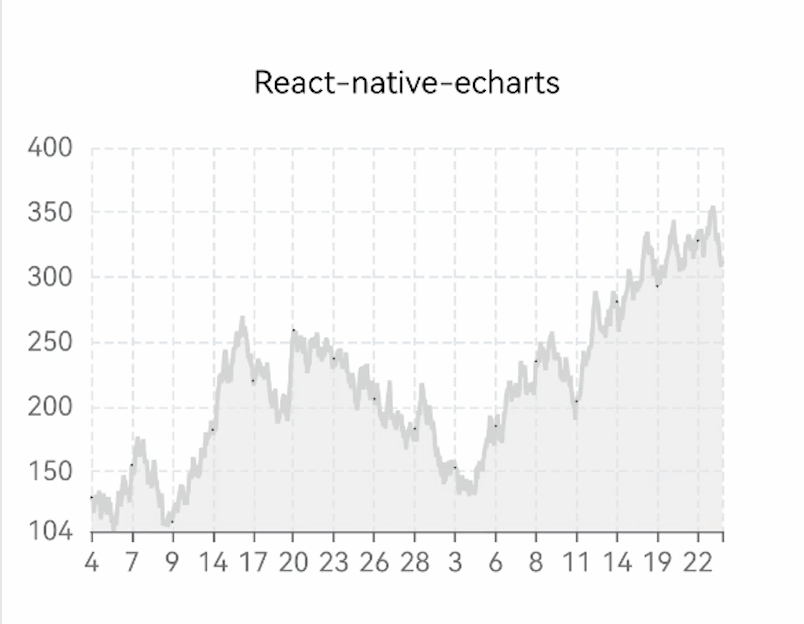

> 簡介：在現代移動應用程序開發中，數據可視化是一個至關重要的部分。圖表庫在React Native應用程序中起著關鍵作用，幫助開發人員以視覺方式呈現和分析數據。在本文中，我們將比較React Native社區中的三個流行圖表庫。讓我們開始這個比較之旅，深入探討React Native ECharts、Victory Native和React Native Chart Kit之間的差異。

## 圖表庫介紹

- **React Native Chart Kit**

  [React Native Chart Kit](https://github.com/indiespirit/React-native-chart-kit)於2018年開發，至今已有5年的歷史。在GitHub上獲得了2.5k+的星星，累計下載次數達到2,840,757次。它已成為React Native社區中非常受歡迎的圖表庫。

- **Victory Native**

  [Victory Native](https://formidable.com/open-source/victory/)是一個於2015年開發的圖表庫。至今已有7年的歷史。它在GitHub上獲得了10.3k+的星星，累計下載次數高達7,434,044次。它是React Native歷史上使用最久、應用最廣泛的圖表庫。

- **React Native ECharts**

  [React Native ECharts](https://wuba.github.io/react-native-echarts/)是今年新推出的圖表庫。目前已有2,565次下載，在GitHub上獲得了363顆星星。作為React Native圖表庫中的新星，它具有巨大的潛力。隨著時間的推移，相信React Native ECharts將成為最受歡迎的圖表庫之一。

  以下是基本數據的比較表格：

  | |  **React Native Chart Kit**   | **Victory Native**  | **React Native ECharts** |
  | --- |  :----:  | :----:  | :---: |
  | 創建日期 | 2018  | 2015 | 2023 |
  | 下載次數 | 2,840,757  | 7,434,044 | 2565 |
  | 解壓後大小 | 399kB  | 78.4kB  | 169kB  |
  | GitHub星星數 | 2.5k+  | 10.3k+ | 363 |
  | 最後發布日期 | 一年前  | 一個月前 | 一個月前 |

## 基本原理比較

- **React Native Chart Kit**
主要的方法是利用React Native的原生視圖組件來創建圖表的基本結構和布局，例如View、Text等。此外，還使用了react-native-svg和paths-js等庫來使用矢量圖形渲染圖表。

- **Victory Native**
也依賴於React Native的原生視圖，並使用SVG進行渲染。它還借鑒了D3（數據驅動文檔）的思想，通過將數據映射到圖表元素並使用比例尺來轉換數據值和位置。

- **React Native ECharts**
獲取ECharts圖表的SVG圖形數據，並重寫ECharts的SVGPainter。通過利用ECharts的現有圖表數據，在React Native端使用react-native-svg或react-native-skia渲染圖表。

## 代碼編寫比較

讓我們以常用的面積圖為例，看看它們是如何使用以下代碼片段實現的：

- **React Native Chart Kit**

```js
import { LineChart } from"react-native-chart-kit";
import { StyleSheet, View, Text } from 'react-native';
const chartConfig = {
   backgroundGradientFrom: "#fff",
   backgroundGradientFromOpacity: 0,
   backgroundGradientTo: "#fff",
   backgroundGradientToOpacity: 0.5,
   color: (opacity = 1) => `rgba(14, 17, 22, ${opacity})`,
   strokeWidth: 2, // optional, default 3
   barPercentage: 0.5,
   useShadowColorFromDataset: false // optional
};
export const LineChart1 = props => {
   const data = {
      labels: ['一', '二', '三', '四', '五', '六', '日'],
      // labels: props.date,
      datasets: [
       {
        data: [150, 230, 224, 218, 135, 147, 260],
        // color: (opacity = 1) => `rgba(134, 65, 244, ${opacity})`, // optional
        strokeWidth: 2 // optional
       }
      ],
    };
   return (
      <View style={styles.container}>
        <Text>React Native Chart Kit</Text>
        <LineChart
           data={data}
           width={400}
           height={200}
           yAxisInterval={1}
           animate
           chartConfig={chartConfig}
           withDots={false}
        />
    </View>
   )

}

```

- **Victory Native**

```js
import { StyleSheet, View, Text } from "react-native";
import {
  VictoryArea,
  VictoryChart,
  VictoryLine,
  VictoryTheme,
  VictoryScatter,
} from "victory-native";

export const LineChart2 = props => {
  const data = [
    { x: '一', y: 150 },
    { x: '二', y: 230 },
    { x: '三', y: 224 },
    { x: '四', y: 218 },
    { x: '五', y: 135 },
    { x: '六', y: 147 },
    { x: '日', y: 260 },
   ];
  return (
   <View style={styles.container}>
    <Text style={styles.title}>Victory Native</Text>
    <VictoryChart
      theme={VictoryTheme.material}
      height={250}
      width={400}
    >
      <VictoryArea
       style={{ data: { fill: "rgba(230, 231, 231,0.8)" } }}
       data={data}
       animate={{
        duration: 2000,
        onLoad: { duration: 1000 },
       }}
      />
      <VictoryLine
       data={data}
       style={{ data: { stroke: "#d6d6d7", strokeWidth: 2 } }}
      />
      <VictoryScatter
       data={data}
       size={4}
       style={{ data: { fill: "#24262a" } }}
      />
    </VictoryChart>
   </View>
  );
};

```

- **React Native ECharts**

```js
import { StyleSheet, Text, View } from 'react-native';
import { useRef, useEffect } from 'react';
import * as echarts from 'echarts/core';
import { LineChart } from 'echarts/charts';
import { GridComponent } from 'echarts/components';
import { SVGRenderer, SkiaChart } from '@wuba/react-native-echarts';
echarts.use([SVGRenderer, LineChart, GridComponent]);
export const LineCharts = props => {
  const skiaRef = useRef(null);
  useEffect(() => {
   const option = {
    xAxis: {
      type: 'category',
      data:  ['一', '二', '三', '四', '五', '六', '日'],
      splitLine: {
       show: true,
       lineStyle: {
        type: 'dashed',
       },}
    },
    yAxis: {
      type: 'value',
      min: 'dataMin',
      splitLine: {
       show: true,
       lineStyle: {
        type: 'dashed',
       },}
    },
    series: [
      {
       data: [150, 230, 224, 218, 135, 147, 260],
       type: 'line',
       areaStyle: {
        color: 'rgba(230, 231, 231,0.8)'
       },
       lineStyle: {
        color: '#d6d6d7'
       },
       symbol: 'circle',
       symbolSize: 8,
       itemStyle: {
        color: '#24262a',
       },
      },
    ],
   };
   let chart;
   if (skiaRef.current) {
    chart = echarts.init(skiaRef.current, 'light', {
      renderer: 'svg',
      width: 400,
      height: 300,
    });
    chart.setOption(option);
   }
   return () => chart?.dispose();
  }, []);
  return (
   <View style={styles.container}>
      <Text style={styles.title}>React Native ECharts</Text>
      <SkiaChart ref={skiaRef} />
   </View>
  );
}
```

效果如下：


從代碼編寫的角度來看，**Victory Native**是數據驅動的，因此通常通過props傳入數據並配置相關樣式。最重要的是，它更像是一組工具，可以自定義圖表。您可以使用Victory提供的各種組件根據需要自定義圖表。例如，如果您想在面積圖中添加線條和數據點，則需要額外包含VictoryLine和VictoryScatter組件。

React Native ECharts和**React Native Chart Kit**在使用上類似。這兩個庫將數據和樣式集中在配置選項中。它們更像是功能齊全的工具，可以通過修改配置來轉換圖表。相比之下，**React Native Chart Kit**的配置代碼更簡單，但可能缺乏一些高級自定義選項。例如，啟用動畫或設置y軸的特定起始值可能無法實現。

在代碼編寫方面，我更喜歡基於配置的方法。它直觀、易於理解，可以提高開發效率。

## 開發體驗

### 渲染性能比較

在常見的面積圖、柱狀圖和餅圖等常規圖表中，三個庫在小數據集下都表現良好，提供流暢的渲染。然而，當數據量達到數千個時，性能差異變得明顯。**Victory Native**和**React Native Chart Kit**在處理大數據集時會出現明顯的延遲，而Victory甚至可能崩潰。另一方面，**React Native ECharts**通過ECharts的默認數據抽樣機制，渲染大量數據時可以避免圖表過度擁擠和性能下降。ECharts根據繪圖區域的寬度和數據點的數量自動抽樣相對較少的數據點，減少計算和渲染時間。利用這一機制，**React Native ECharts**在處理大數據集時展示出顯著更好的渲染性能。

以下是使用隨機生成的200個數據點渲染面積圖的示例：


可以看到，**React Native ECharts**仍然保持較好的渲染性能。另一方面，使用其他兩個庫需要對數據和坐標進行調整以滿足特定的業務需求。

當我們將測試數據增加到2000個點時，**React Native Chart Kit**出現明顯的渲染延遲，而**Victory Native**則報錯說超出了最大調用堆棧大小。與此同時，**React Native ECharts**由於數據抽樣的好處，在渲染大量數據時仍然提供滿意的渲染結果：



### 圖表種類比較

- **React Native Chart Kit**
目前，**React Native Chart Kit**支持的圖表類型相對有限。它主要涵蓋了六種特定類型的圖表，可以滿足大多數基本業務需求。但是，如果需要其他類型的圖表，可能需要引入其他庫。

  以下圖像展示了**React Native Chart Kit**可以涵蓋的大部分圖表類型，可以看出種類相對有限。😭目前，開發人員正在持續維護該庫，未來可能會添加更多的圖表類型。


<font size>(圖片來源：https://github.com/indiespirit/react-native-chart-kit)</font>

- **Victory Native**
在圖表種類方面，**Victory Native**相對於**React Native Chart Kit**提供了更多的選擇。然而，由於Victory的方法需要組合組件來創建不同類型的圖表，開發人員需要對組件組合有很好的理解並具備扎實的編碼能力。此外，官方Victory網站提供的示例可能對初學者來說不太友好，因為支持的圖表實例可能不是立即直觀的。總的來說，使用**Victory Native**需要更高的編碼能力和邏輯思維。

  以下圖像展示了Victory在其官方網站上提供的主要組件。可以看到相比**React Native Chart Kit**，這裡提供了更多的選項。此外，**Victory Native**主要依賴於組合這些組件，如點、線、區域和軸，來創建各種類型的圖表。這使得支持的圖表類型更多樣化。


<font size="2">(圖片來源：https://formidable.com/open-source/victory/docs/)</font>


- **React Native ECharts**
您可以直接參考ECharts官方網站上的示例，其中以高度直觀的方式展示了各種類型的圖表。開發人員可以使用配置選項根據自己的需求自定義圖表。目前，**React Native ECharts**支持渲染ECharts提供的大多數圖表類型。
**React Native ECharts** 利用 ECharts 提供的 SVG 數據，這意味著使用者可以通過參考 ECharts 網站上提供的示例並配置相應的設置，輕鬆渲染各種不同類型的圖表😍


<font size="2">(圖片來源：https://echarts.apache.org/examples/zh/index.html)</font>

下圖展示了一些其他庫難以實現或需要複雜組合的圖表類型。然而，使用 **React Native ECharts**，您可以輕鬆通過參考文檔來實現這些圖表🚀


### 指南比較

開始使用 **React Native Chart Kit** 主要涉及使用庫作者提供的文檔和配置選項，這些可以在 GitHub 或 npm 上找到。通過參考這些資源，開發人員可以輕鬆在項目中實現圖表渲染。

另一方面，**Victory Native** 有自己的[網站](https://formidable.com/open-source/victory/docs/)，開發人員可以通過參考文檔中提供的組件和相關代碼來組合圖表。然而，該網站提供了大量的組件和元素，使得開發人員很難快速找到所需的示例。實現複雜的圖表通常需要開發人員思考自己的實現方法，這可能降低開發效率。

相比於 **Victory Native** 和 **React Native Chart Kit**，**React Native ECharts** 具有以下幾個優勢：

- 文檔

  **Victory Native** 的[官方文檔](https://wuba.github.io/react-native-echarts/)描述更清晰、全面，並提供了可直接使用的示例。開發人員可以通過文檔輕鬆理解庫的功能、配置和用法。此外，官方 ECharts 網站提供了大量的[使用示例](https://echarts.apache.org/examples/zh/index.html)，進一步幫助開發人員快速實現各種類型的圖表。

- 在線預覽

  與 ECharts 库一樣，**React Native ECharts** 提供了在線預覽和測試支持。您可以直接複製圖表配置，查看它在 React Native 中的渲染效果。[點擊此處進行在線預覽](https://wuba.github.io/react-native-echarts/zh-Hans/docs/expo-snacks/simple-line-chart)

- 多端代碼

  **React Native ECharts** 還支持在 Web 上重用組件，實現跨平台需求，並在多個平台上實現代碼共享。它輕鬆實現代碼統一性，確保不同平台上的圖表一致性，從而提高開發效率。

- 支持兩種渲染模式

  **React Native ECharts** 支持兩種渲染模式：Svg 和 Skia。它基於 react-native-svg 和 react-native-skia 實現。react-native-skia 利用 Skia Graphics Library，這是一個高性能的圖形渲染引擎，提供更快的繪製和渲染速度。對於希望體驗 Skia 能力的開發人員來說，這是一個福音。

## 總結
無可否認，**Victory Native** 和 **React Native Chart Kit** 都是 React Native 的優秀圖表庫。然而，新引入的 **React Native ECharts** 在適用性和入門的易用性方面具有一定的優勢。特別是在一些相對複雜但常見的圖表中，例如路徑圖、雷達圖和K線圖，**React Native ECharts** 提供了示例，開發人員只需修改示例代碼中的數據即可輕鬆實現這些圖表。在這些場景中，強烈推薦使用 **React Native ECharts**，它大大提高了開發效率。此外，對於對各種類型的圖表需求較高的項目，**React Native ECharts** 提供的豐富的圖表示例使我們更容易應對多樣化的圖表需求😁

